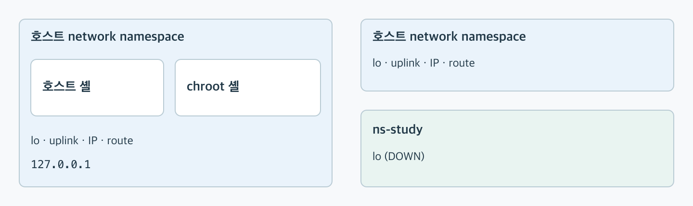
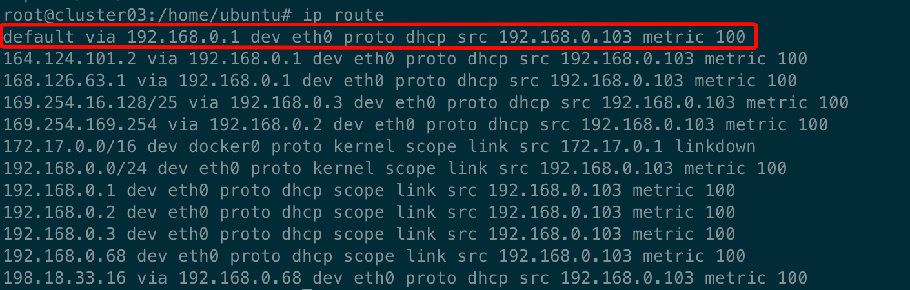
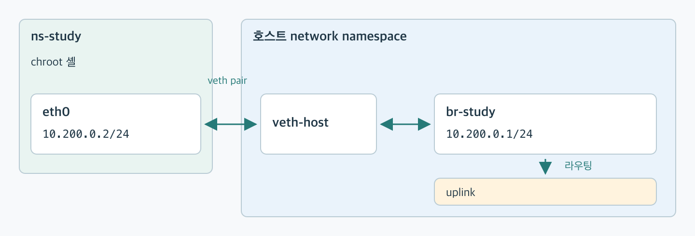
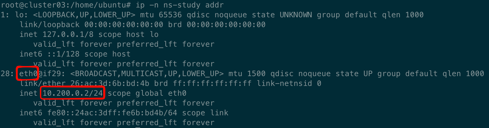
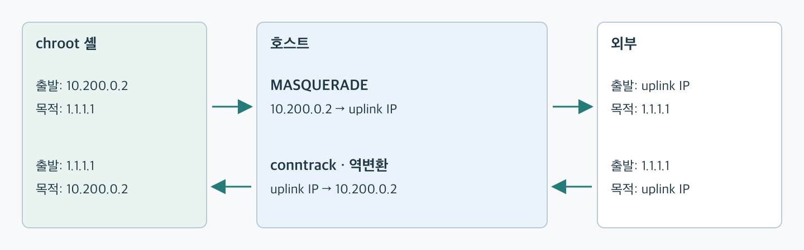
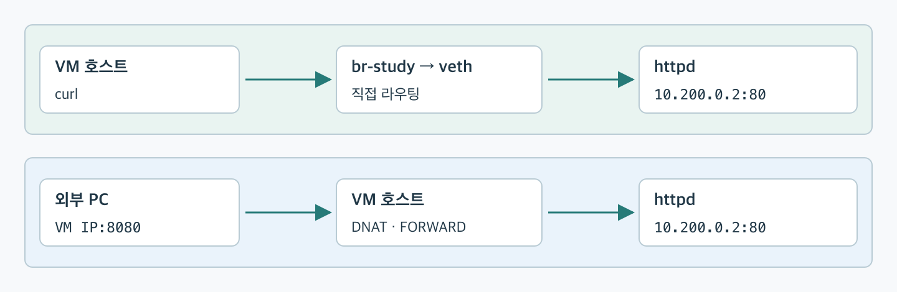

# 5주차: 네트워크를 격리하고 chroot 셸 연결하기

## 이번 주 목표

- network namespace로 네트워크를 격리하기
- veth와 bridge로 network namespace를 호스트에 연결하기
- NAT를 설정해 외부와 통신하고, 호스트에서 chroot 셸의 HTTP 서버에 접근하기

## 시작하기

지난주에는 rootfs를 교체하고 자원 사용량을 제한했습니다. 네트워크는 호스트와 공유하고 있었습니다.

이번에는 네트워크도 나누고 직접 연결해봅시다. Docker가 준비해주던 IP·route·NAT를 직접 설정해보는게 목표입니다. (좀 복잡하지만 큰 틀에서 이해하면 좋을 것 같습니다)

- [카카오 핸즈온 1:33:10~1:41:38](https://www.youtube.com/watch?v=lVtgqmjv4BQ&t=5590s)
- [KodeKloud: Network Namespaces Basics Explained in 15 Minutes](https://www.youtube.com/watch?v=j_UUnlVC2Ss)
- [docker network 개념](https://www.youtube.com/watch?v=W7X6u2BGVRY) => 이 영상을 한번 보고 이번주 실습을 진행하면 좋을 것 같습니다.

## 핵심 개념

### network namespace

network namespace는 인터페이스, IP 주소, 라우팅 테이블, 포트를 격리합니다.

#### 네트워크 공유와 격리



### 연결에 필요한 것

| 구성 요소 | 역할 |
|---|---|
| veth pair | 두 namespace를 연결하는 가상 인터페이스 쌍 |
| bridge | 여러 인터페이스를 연결하는 가상 스위치 |
| route | 목적지로 보낼 경로 선택 |
| IP forwarding | 호스트가 다른 네트워크로 패킷을 전달하도록 설정 |
| SNAT | 외부로 나가는 패킷의 출발지 주소를 호스트 주소로 변환 |
| DNS | 도메인 이름을 IP 주소로 변환 |

bridge에 연결하면 같은 네트워크 안에서 통신할 수 있습니다. 이번 구성에서 외부로 통신하려면 route·forwarding·NAT도 설정이 필요합니다.

## 실습 준비

제공받은 VM에서 `tmproot`가 있는 디렉터리로 이동합니다. 두 터미널을 사용합니다.

- **터미널 A:** 호스트에서 네트워크 설정과 HTTP 요청
- **터미널 B:** Docker 컨테이너 또는 chroot 셸

**터미널 A의 호스트**에서 확인합니다.

```bash
ip route
# 현재 forwarding 값(0 또는 1). 정리할 때 복원하기 위함
forward_before=$(sysctl -n net.ipv4.ip_forward)
# 실습에서 변경할 DNS 설정 백업
sudo cp -p tmproot/etc/resolv.conf tmproot/etc/resolv.conf.week05-backup
```



이 VM의 외부 인터페이스는 `eth0`입니다. ( `ip route`의 `default` 줄에 나온 인터페이스 이름) 겹치지 않는 `10.200.0.0/24`대역을 사용할 예정입니다.

## 실습

### 1. Docker가 준비한 네트워크 관찰하기

**터미널 B의 호스트**에서 Docker 컨테이너를 실행합니다.

```bash
sudo docker run --rm -it busybox sh
```

**컨테이너 안에서** 인터페이스와 경로를 확인하고 외부에 요청합니다.

```sh
# 현재 namespace의 인터페이스와 IP 주소 확인
ip addr
# 현재 라우팅 테이블 확인: default는 다른 경로가 없을 때 사용하는 경로
ip route
# 도메인 조회에 사용하는 DNS 서버 주소 확인
cat /etc/resolv.conf
wget -O- http://example.com
```

컨테이너 안에서 외부 주소에 접근할 수 있습니다.

**터미널 A의 호스트**에서도 다음을 확인해봅니다. `docker0`은 도커가 기본으로 만드는 가상 bridge입니다. 호스트 안에서 컨테이너들을 연결하기 위한 스위치라고 생각하면 됩니다.

```bash
# Docker 기본 bridge인 docker0의 IP와 상태 확인
ip addr show docker0
# 호스트의 인터페이스가 어느 bridge에 연결되어 있는지 확인
bridge link
```

> 확인: 컨테이너의 IP와 gateway는 무엇인가요? 호스트에서 보이는 veth는 어디에 연결되어 있나요?

**터미널 B**에서 `exit`으로 컨테이너를 종료한 뒤, **터미널 A**에서 `bridge link`를 다시 확인합니다. 컨테이너의 veth는 사라지고 `docker0`은 남습니다.

### 2. network namespace 만들고 veth pair로 호스트와 연결하기

**터미널 A의 호스트**에서 실행합니다.

```bash
sudo ip netns add ns-study
# ns-study 안의 인터페이스와 IP 확인(-n: 대상 namespace 지정)
sudo ip -n ns-study addr
```

`lo`만 보이고 아직 통신할 인터페이스가 없습니다. loopback을 활성화해줍니다.

```bash
# ns-study의 loopback 인터페이스 활성화(up)
sudo ip -n ns-study link set lo up
```

이제 ns-study 네임스페이스와 호스트 network namespace를 veth, bridge로 연결해봅니다.



**터미널 A의 호스트**에서 bridge를 만들고 호스트의 주소를 설정합니다.

```bash
# br-study라는 이름의 가상 bridge 생성 (docker0에 대응)
sudo ip link add br-study type bridge
# br-study에 호스트 IP 설정
sudo ip addr add 10.200.0.1/24 dev br-study
# bridge 활성화
sudo ip link set br-study up
```

veth pair를 만들고 한쪽은 bridge에, 다른 쪽은 namespace에 넣습니다.

```bash
# 서로 연결된 veth-host와 veth-ns 인터페이스 쌍 생성
sudo ip link add veth-host type veth peer name veth-ns
# 호스트 쪽 veth를 br-study에 연결(master: 소속 bridge)
sudo ip link set veth-host master br-study
# 호스트 쪽 veth 활성화
sudo ip link set veth-host up
# 반대쪽 veth를 ns-study 안으로 이동
sudo ip link set veth-ns netns ns-study
```

namespace 쪽 이름을 `eth0`로 바꾸고 IP를 설정합니다.

```bash
# ns-study 안의 veth-ns를 eth0로 이름 변경
sudo ip -n ns-study link set veth-ns name eth0
# ns-study의 eth0에 IP 설정
sudo ip -n ns-study addr add 10.200.0.2/24 dev eth0
# ns-study의 eth0 활성화
sudo ip -n ns-study link set eth0 up
```



**터미널 B의 호스트**에서 `ns-study` 안에 chroot 셸을 실행합니다.

```bash
# ns-study netns에서 tmproot를 루트로 삼아 셸 실행
sudo ip netns exec ns-study chroot tmproot /bin/sh
```

**chroot 셸 안에서** 확인합니다. 이 셸은 `tmproot`를 `/`로 사용하고, 네트워크는 `ns-study`에 속합니다.

```sh
# 현재 namespace의 인터페이스와 IP 주소 확인
ip addr
# bridge에 설정한 호스트 IP로 ping
ping -c 1 10.200.0.1
# 외부 IP(1.1.1.1)로 ping
ping -c 1 1.1.1.1
```

> 1.1.1.1은 Cloudflare가 제공하는 DNS 서버의 주소입니다.

호스트의 `10.200.0.1`에는 도달하지만, 외부로 가는 경로는 아직 없습니다. 외부 IP로 보낸 요청은 다음처럼 실패할 겁니다.

```text
ping: sendto: Network is unreachable
```

> 확인: veth의 양 끝은 각각 어디에 있나요? 호스트 쪽 IP는 veth와 bridge 중 어디에 설정했나요?

### 3. 아웃바운드 통신 연결하기 (chroot 셸 → 외부) : SNAT

이제 외부 아웃바운드 통신이 가능하도록 설정해봅시다.

**터미널 A**에서 default route를 추가합니다. 같은 subnet 밖으로 보내는 패킷은 호스트의 `10.200.0.1`로 향합니다.

```bash
# 다른 subnet으로 가는 패킷은 10.200.0.1로 전송(via)
sudo ip -n ns-study route add default via 10.200.0.1
```

호스트가 패킷을 전달할 수 있도록 forwarding을 켭니다. Docker가 설정한 FORWARD 규칙보다 앞에서 실습 트래픽을 허용합니다.

```bash
# 호스트의 IPv4 패킷 전달 활성화
sudo sysctl -w net.ipv4.ip_forward=1
# 전달 규칙 맨 앞에 삽입(-I): br-study로 들어와(-i) eth0로 나가는(-o) 패킷 허용(-j ACCEPT)
sudo iptables -I FORWARD -i br-study -o eth0 -j ACCEPT
# 나갔다가 돌아오는 응답과 관련한 패킷을 허용
sudo iptables -I FORWARD -i eth0 -o br-study -m conntrack --ctstate ESTABLISHED,RELATED -j ACCEPT
```

첫 규칙은 외부로 나가는 요청을, 두 번째 규칙은 돌아오는 응답을 허용합니다. 이제 외부로 나가는 출발지 IP를 호스트의 `eth0` 주소로 바꿉니다. (SNAT)

```bash
# NAT 테이블(-t nat)의 송출 단계(POSTROUTING)에 규칙 추가(-A): 실습 subnet 출발(-s) 주소를 eth0 IP로 변환
sudo iptables -t nat -A POSTROUTING -s 10.200.0.0/24 -o eth0 -j MASQUERADE
```

#### NAT의 왕복 경로



다시 **터미널 B의 chroot 셸 안에서** 외부 IP에 도달하는지 확인합니다.

```sh
ip route
ping -c 1 1.1.1.1
```

아까와는 다르게 동작하는 걸 확인할 수 있습니다!

1.1.1.1을 DNS 서버로 설정하고 이제 외부 도메인으로도 접근해봅시다.

```sh
# DNS 서버를 1.1.1.1로 설정
printf 'nameserver 1.1.1.1\n' > /etc/resolv.conf
wget -O- http://example.com
# 외부 서버가 보는 공인 IP 확인
wget -qO- http://checkip.amazonaws.com
```

`MASQUERADE`를 거치면 출발지는 `10.200.0.2`에서 호스트 `eth0`의 IP인 `192.168.0.103`으로 바뀝니다. 위에서 확인한 공인 IP는 VM 밖에서 NAT가 한 번 더 적용된 주소일 수 있습니다.

> 확인: 목적지 IP는 그대로인데 출발지 IP를 바꾸는 이유는 무엇일까요?

### 4. 인바운드 확인하기 (호스트 → chroot 환경의 HTTP 서버)

이번에는 VM 호스트에서 `ns-study` 안의 HTTP 서버로 요청을 보내봅시다!

**터미널 B의 chroot 셸 안에서** HTTP 서버를 실행합니다. `httpd`로 최소 구성 실행해봅니다.

```sh
# HTTP 서버가 제공할 디렉터리와 페이지 준비
mkdir -p /www
echo 'hello world' > /www/index.html
# 포그라운드 실행(-f), 80번 포트(-p), 제공할 디렉터리(-h)
httpd -f -p 80 -h /www
```

**터미널 A의 호스트**에서 요청해봅니다.

```bash
curl http://10.200.0.2
```

`hello world`가 나오면 성공입니다. 호스트는 `10.200.0.2`로 직접 접근할 수 있으므로 DNAT가 필요하지 않습니다.

#### 호스트 접근과 VM 외부 접근



**VM 밖에서 들어오는 요청**을 호스트 IP의 포트로 받으려면, 들어온 요청을 chroot 셸의 HTTP 서버에 보내도록 `10.200.0.2:80`으로 목적지를 바꾸는 DNAT와 전달 허용을 추가해야 합니다. (지금 우리는 한 공인 IP를 여러 VM이 같이 사용하고 있어서 테스트하기가 어려울 것 같네요)

> 확인: chroot 셸 안의 `127.0.0.1:80`과 호스트의 `127.0.0.1:80`은 같은 서버인가요?

### 실습 네트워크 정리

**터미널 B**에서 `Ctrl-C`로 HTTP 서버를 종료한 뒤 `exit`으로 chroot 셸을 나옵니다.

**터미널 A의 호스트**에서 추가했던 규칙을 제거합니다.

```bash
# 추가했던 출발지 주소 변환 규칙 삭제
sudo iptables -t nat -D POSTROUTING -s 10.200.0.0/24 -o eth0 -j MASQUERADE
# ns-study에서 외부로 나가는 패킷의 전달 허용 규칙 삭제
sudo iptables -D FORWARD -i br-study -o eth0 -j ACCEPT
# 외부 응답의 전달 허용 규칙 삭제
sudo iptables -D FORWARD -i eth0 -o br-study -m conntrack --ctstate ESTABLISHED,RELATED -j ACCEPT
```

namespace와 bridge를 지우고 forwarding을 원래 값으로 되돌립니다. namespace가 사라지면 그 안의 veth와 호스트 쪽 짝도 사라집니다.

```bash
# network namespace 삭제
sudo ip netns del ns-study
# bridge 삭제
sudo ip link del br-study
# 실습 전에 저장한 forwarding 값으로 복원
sudo sysctl -w net.ipv4.ip_forward="$forward_before"
# tmproot의 DNS 설정 복원
sudo mv tmproot/etc/resolv.conf.week05-backup tmproot/etc/resolv.conf

ip netns list
# br-study와 veth pair가 삭제됐는지 확인
ip link
```

### 정리

보통 우리는 docker를 사용해서 웹 서버를 container로 올리고, 이를 host의 특정 포트와 매핑해서 외부에서도 접근 가능하도록 사용합니다. 그 과정에서 docker가 networking(linux bridge)을 위해 하는 것 중 일부를 이번주에 해보았는데요. 정리하면 다음과 같습니다.

| 구성                 | 우리가 한 일                                             | Docker가 하는 일                                |
| -------------------- | -------------------------------------------------------- | ----------------------------------------------- |
| 네트워크 격리        | network namespace (`ns-study`) 생성                      | 컨테이너용 network namespace 준비               |
| 연결                 | veth를 host bridge(`br-study`)에 연결                    | veth를 `docker0` 또는 사용자 정의 bridge에 연결 |
| 주소·경로            | IP와 default route 직접 설정 (ip addr add, ip route add) | IP를 할당하고 gateway·route 설정                |
| 외부 아웃바운드 요청 | forwarding·허용 규칙·MASQUERADE 설정                     | 해당 설정과 응답 허용 규칙을 자동으로 관리      |
| 호스트에서 직접 접근 | `10.200.0.2:80`로 HTTP 요청, NAT 불필요                  | 컨테이너 IP로 직접 접근 가능 (동일)             |
| 외부 인바운드 요청   | 이번에 진행 X                                            | `-p`에 따라 포트 전달과 허용 규칙 설정          |
| DNS·정리             | 파일 수정과 자원 삭제                                    | DNS 설정, 연결 해제와 자원 회수 관리            |

## 체크리스트

- [ ] 새 network namespace에는 처음에 `lo`만 있는 것을 확인했다.
- [ ] chroot 셸에서 bridge의 `10.200.0.1`에 도달했다.
- [ ] default route·forwarding·NAT를 설정하고 외부로 아웃바운드 통신을 확인했다.
- [ ] 호스트에서 chroot 셸의 HTTP 서버에 접근 성공했다.

## 심화 질문

1. namespace·veth·bridge·route·forwarding·NAT는 패킷 경로에서 각각 어떤 역할을 하나요?
2. NAT만 제거하면 호스트와의 통신과 외부 통신은 어떻게 달라질까요?
3. 호스트에서는 `10.200.0.2`로 직접 접근할 수 있는데, VM 외부에서는 왜 추가 설정이 필요할까요?
4. 별도의 network namespace를 쓰는 컨테이너 안의 웹 서버가 `127.0.0.1`에서만 listen하면 호스트에서 접근할 수 있을까요? `0.0.0.0`에서 listen하면 무엇이 달라지나요?
