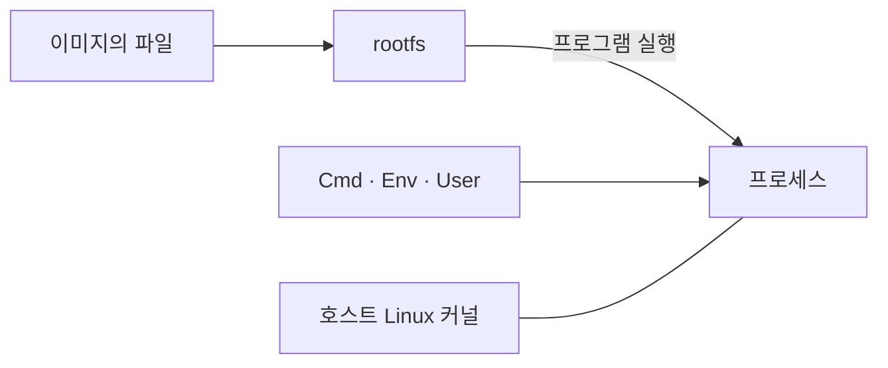
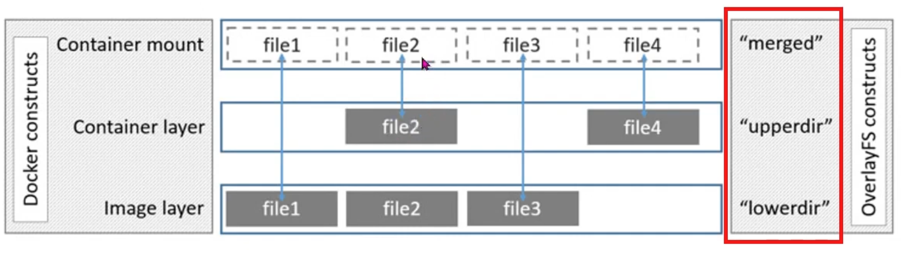
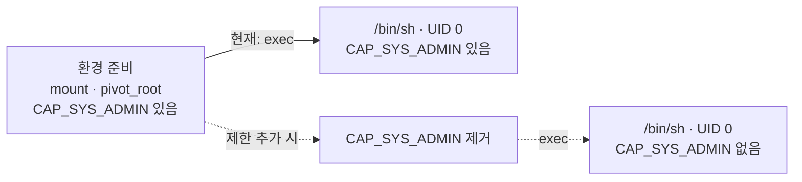
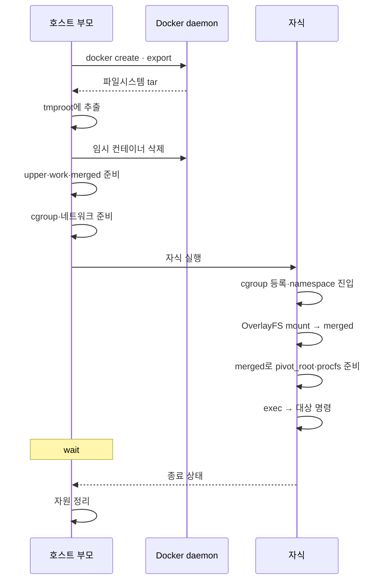

# 6주차: 이미지로부터 컨테이너 실행하기

`docker run busybox`를 실행하면 이미지의 파일로 컨테이너 프로세스가 시작됩니다. 그 프로세스는 어떻게 파일을 쓰고, 어떤 권한으로 동작할까요?

## 이번 주 목표

- 이미지, rootfs, 프로세스의 관계를 짧게 복습합니다.
- OverlayFS로 원본과 변경분을 나누고, 파일 수정·생성·삭제 결과를 확인합니다.
- 4주차 스크립트가 `tmproot` 대신 OverlayFS의 `merged`를 사용하도록 바꿉니다.
- namespace를 나누는 것과 프로세스 권한을 줄이는 것을 구분합니다.

## 실습 준비

제공받은 **VM**에서 진행합니다. 호스트에서 `tmproot`가 있는 디렉터리로 이동합니다. 기존 실습 셸을 종료하고 `tmproot`의 mount를 정리한 상태에서 시작합니다.

```bash
sudo docker image ls
sudo ls tmproot/bin/sh
```

**`tmproot`가 없다면** 다시 만들어줍니다.

```bash
mkdir tmproot
cid=$(sudo docker create --pull=never busybox:latest)
sudo docker export "$cid" | sudo tar -C tmproot -xf -
sudo docker rm -v "$cid"
```

## 개념과 실습

### 1. 이미지·rootfs·프로세스 복습

**이미지**는 프로그램·라이브러리 같은 파일과 실행 설정을 담습니다. 이 파일들로 프로세스의 `/`를 구성한 것이 **rootfs**이고, 그 안의 프로그램을 실행하면 **프로세스**가 시작됩니다.



`tmproot`에는 이미지에서 꺼낸 파일이 있습니다. 실행 중인 프로세스와는 별개이며, `docker export`로 파일을 꺼냈다고 이미지의 실행 설정까지 적용되지는 않습니다. 이번에는 이 파일을 원본으로 두고, 실행 중 바뀌는 파일을 별도로 저장해봅니다.

### 2. OverlayFS로 원본과 변경분 나누기

같은 이미지로 컨테이너를 여러 개 실행해도 한 컨테이너의 파일 수정이 다른 컨테이너에 반영되지는 않습니다. *이미지 원본은 공유하고, 각 컨테이너의 변경분은 따로 저장하기 때문입니다.*

여러 디렉터리를 하나의 파일시스템처럼 합쳐 보여주는 방식을 **union filesystem**이라고 합니다. **OverlayFS**는 Linux 커널이 제공하는 구현의 일종입니다. 우리는 `mount -t overlay` 명령어로 이를 확인할 수 있습니다.

#### union filesystem



출처: [Docker의 OverlayFS 설명](https://docs.docker.com/engine/storage/drivers/overlayfs-driver/#image-and-container-layers-on-disk)

- **lowerdir:** 원본 파일 `file1`, `file2`, `file3`이 있습니다.
- **upperdir:** 수정한 `file2`와 새로 만든 `file4`가 있습니다.
- **merged:** 프로세스가 보는 경로입니다. 양쪽 파일이 함께 보이고, 같은 경로의 파일은 upperdir가 우선합니다.

그림의 `file1`과 `file3`은 lowerdir에서, `file2`와 `file4`는 upperdir에서 읽습니다. 이 구성을 직접 만들어봅시다.

#### makecontainer.sh

아래 코드를 작업 디렉터리의 `makecontainer.sh`로 저장해서 사용해봅시다. (4주차까지의 내용과 유사) 여기서는 기존 `tmproot`를 사용하고 실행할 명령만 인자로 받습니다.

```bash
#!/usr/bin/env bash
set -euo pipefail

# 호스트에서 준비한 rootfs의 절대 경로
rootfs=$(realpath tmproot)

exec unshare --uts --pid --fork --mount bash -c '
    set -euo pipefail
    rootfs=$1
    shift

    mount --make-rprivate /
    hostname myhost

    # pivot_root의 대상은 mount point여야 함
    mount --bind "$rootfs" "$rootfs"
    mkdir -p "$rootfs/put_old"
    cd "$rootfs"
    pivot_root . put_old
    cd /
    hash -r

    umount -l /put_old
    rmdir /put_old
    mkdir -p /proc
    mount -t proc proc /proc

    exec "$@"
' makecontainer-init "$rootfs" "$@"
```

`unshare`는 UTS·PID·mount namespace를 나누고, `pivot_root`는 준비된 rootfs를 `/`로 바꿉니다. `hash -r`은 루트 교체 전에 Bash가 기억한 명령 경로를 비웁니다. 마지막 `exec`에서 실행할 명령으로 바뀝니다. CPU·메모리 제한(4주차)과 네트워크 설정(5주차)은 이 최소 구성에 포함하지 않습니다.

#### 원본과 쓰기 영역 준비하기

**호스트에서** 실행합니다. `tmproot`는 그대로 두고, OverlayFS에 필요한 3개 디렉터리를 만들어줍니다.

file1,2,3을 tmproot 하위에 만들어줍니다. 이는 image layer의 파일이 될 겁니다.

```bash
mkdir upper work merged
printf 'original\n' | sudo tee tmproot/file1 tmproot/file2 tmproot/file3
```

| 경로        | 이번 실습에서의 역할                                                   |
| ----------- | ---------------------------------------------------------------------- |
| `tmproot` | lowerdir. 이미지에서 꺼낸 파일과 관찰할 원본 파일                      |
| `upper`   | upperdir. 실행 중 변경분이 기록                                        |
| `work`    | 커널 작업 공간. 처음에는 비어 있어야 하며 upper와 같은 파일시스템에 둠 |
| `merged`  | 원본과 변경분을 합쳐 볼 mount 지점                                     |

**호스트에서** OverlayFS를 mount합니다.

```bash
sudo mount -t overlay overlay \
  -o lowerdir="$PWD/tmproot",upperdir="$PWD/upper",workdir="$PWD/work" \
  merged
findmnt --mountpoint merged
cat merged/file2
```

파일시스템 종류가 `overlay`로 나오고, `file2`에서는 `original`을 읽습니다. (아직 upper에 변경분이 없음)

#### 스크립트의 rootfs를 merged로 바꾸기

`makecontainer.sh`에서 rootfs 경로를 바꿉니다. 이제는 *tmproot를 직접 rootfs로 사용하지 않습니다*.

```bash
# 변경 전
rootfs=$(realpath tmproot)
# 변경 후
rootfs=$(realpath merged)
```

`merged`는 이미 mount point이므로 다음 줄은 삭제합니다. 나머지 `pivot_root`와 procfs 준비는 그대로 사용합니다.

```bash
mount --bind "$rootfs" "$rootfs"
```

이제 **호스트에서** 수정한 스크립트를 실행합니다.

```bash
sudo bash ./makecontainer.sh /bin/sh
```

**chroot 셸 안에서** 원본 파일을 읽고, 하나를 수정하고, 새 파일도 만듭니다. 이번 셸의 `/`는 `pivot_root`로 교체한 `merged`입니다.

```sh
cat /file1 /file2 /file3
echo changed > /file2
echo new > /file4
cat /file2 /file4
exit
```

**호스트에서** 같은 파일을 세 경로로 확인합니다.

```bash
cat tmproot/file2
sudo cat upper/file2
cat merged/file2
sudo cat upper/file4
```

순서대로 `original`, `changed`, `changed`, `new`가 나옵니다. `file2`를 처음 수정할 때 커널이 원본을 upper로 복사한 뒤 수정했습니다. 이 동작이 **copy-up**입니다. merged는 upper의 수정본을 보여주고, tmproot의 원본은 그대로 남습니다. 새 파일 `file4`도 upper에만 생겼습니다.

> 확인: 스크립트에서 `/`로 사용한 경로는 어디인가요? 셸에서 수정한 `file2`가 원본을 덮어쓰지 않은 이유는 무엇인가요?

#### 종료 후 변경분과 파일 삭제 확인하기

같은 스크립트를 다시 실행합니다. **호스트에서** 시작합니다.

```bash
sudo bash ./makecontainer.sh /bin/sh
```

**chroot 셸 안에서** 확인한 뒤 `file3`을 삭제합니다.

```sh
cat /file2 /file4
rm /file3
ls /file3
exit
```

`file2`와 `file4`는 여전히 `changed`, `new`입니다. 프로세스가 끝나도 같은 upper를 사용하면 변경분은 남습니다. `file3`은 삭제했으므로 `ls`에서 없다는 오류가 납니다.

**호스트에서** 원본과 쓰기 영역을 확인합니다.

```bash
cat tmproot/file3
sudo ls -l upper/file3
ls merged/file3
```

원본은 `original` 그대로인데 merged에서는 보이지 않습니다. upper에는 원본을 숨기는 **whiteout(삭제 표시)**이 남습니다. 표시 형식은 커널에 따라 장치 파일이나 확장 속성을 가진 파일일 수 있습니다.

컨테이너를 멈추는 것과 쓰기 영역을 삭제하는 것은 다릅니다. 같은 쓰기 영역으로 다시 실행하면 변경을 유지하고, 새 쓰기 영역으로 실행하면 원본에서 다시 시작합니다.

#### 실습 정리

셸을 모두 종료한 뒤 **호스트에서** OverlayFS를 해제합니다. 스크립트 안에서 만든 procfs는 자식의 mount namespace와 함께 사라지지만, 호스트에서 만든 OverlayFS mount는 직접 해제해야 합니다.

```bash
sudo umount merged
findmnt --mountpoint merged
```

`findmnt`에 출력이 없는 것을 확인한 뒤, 이번에 만든 변경분과 작업 공간, 관찰용 원본 파일을 지웁니다. `tmproot` 자체는 남겨둡니다.

```bash
sudo rm -rf upper work
rmdir merged
sudo rm tmproot/file1 tmproot/file2 tmproot/file3
```

### 3. capability: 프로세스에 허용할 관리자 작업 정하기

우리 스크립트는 `sudo`로 실행합니다. rootfs를 준비하면서 `mount` 같은 관리자 작업을 해야 하기 때문입니다. 하지만 컨테이너 내에서 실행할 프로그램에도 이 권한이 필요할까요?

Linux는 root의 관리자 권한을 여러 항목으로 나눠서 프로세스에 부여합니다. 이 항목 하나하나가 **capability**입니다. 프로세스가 가진 capability 목록을 “이 프로세스에 허용된 관리자 작업 목록”으로 생각하면 됩니다. 컨테이너 전용 기능은 아니며, Docker도 이 Linux 기능으로 컨테이너 안의 프로세스 권한을 제한합니다.

예를 들어 프로세스가 `mount`를 요청하면 커널은 **`CAP_SYS_ADMIN`이라는 capability가 있는지** 검사합니다. 이 항목이 없으면 UID가 0(root)이어도 mount할 수 없습니다. `CAP_SYS_ADMIN`은 mount를 포함한 여러 관리자 작업에 쓰이는 권한입니다.

mount namespace는 프로세스마다 마운트 구성을 나눕니다. capability는 **그 프로세스에 mount할 권한이 있는지**를 결정하는 데 쓰입니다. 따라서 namespace를 나누는 것만으로 권한까지 줄어들지는 않습니다.

#### 환경 준비 후 권한을 줄인다면

환경을 준비할 때는 mount할 권한이 필요하지만, 파일을 읽고 쓰는 프로그램에 이 권한까지 넘길 필요는 없습니다.



**우리 스크립트는 위쪽 경로입니다.** capability를 줄이지 않아 실행한 셸에도 환경 준비에 썼던 권한이 남습니다. 아래쪽은 준비를 마친 뒤 불필요한 권한을 제거하는 흐름이며, 이번 실습에는 적용하지 않았습니다.

Docker는 기본적으로 컨테이너 프로세스의 capability를 줄이며, `CAP_SYS_ADMIN`도 기본 허용 목록에서 제외합니다. 컨테이너 안에서 root로 실행되더라도 mount가 허용되지 않는 이유입니다. [Docker 권한 설정](https://docs.docker.com/engine/containers/run/#runtime-privilege-and-linux-capabilities)

> 확인: namespace를 나눈 뒤에도 실행한 셸에 mount할 권한이 남아 있는 이유는 무엇인가요?

### 4. 총정리

이미지 준비, 격리, 자원 제한, 네트워크는 각각 다른 일을 합니다. `makecontainer.sh`의 각 명령이 어느 역할을 맡는지 설명하면서 연결해봅시다. 다 만들어지면 실행 예시는 다음과 같을 것입니다.

```bash
sudo ./makecontainer.sh busybox:latest -- /bin/sh
```

지금은 기존 `tmproot`를 쓰는 최소 스크립트에서 OverlayFS를 확인했습니다. 다음으로 이미지 이름을 받으면 스크립트가 `tmproot`와 OverlayFS까지 준비하도록 확장합니다. `--` 뒤의 명령을 직접 실행하고, 끝나면 만든 자원을 정리합니다. Docker는 이미지에서 파일을 꺼낼 때 사용합니다.

#### 준비·실행·정리 순서



| 역할                    | 사용하는 기능                              | 빠지면 어떻게 될까?                          |
| ----------------------- | ------------------------------------------ | -------------------------------------------- |
| 실행할 파일 준비        | `docker create`·`export`, `tmproot` | 이미지 안의 프로그램을 실행할 파일이 없음    |
| 원본과 변경분 분리      | OverlayFS의 lowerdir·upperdir·merged     | 원본 rootfs에 직접 쓰게 됨                   |
| 자원 범위와`/` 구성   | namespace,`pivot_root`, procfs           | 호스트와 공유하는 범위가 달라짐              |
| CPU·메모리 사용량 제한 | cgroup                                     | 설정하려던 사용량 상한이 적용되지 않음       |
| 통신 경로 구성          | veth·bridge·route·NAT·DNS              | 연결하지 않은 경로로는 통신할 수 없음        |
| 종료 확인과 정리        | 부모의`wait`, cleanup                    | 종료 상태를 받거나 남은 자원을 회수하지 못함 |

자식은 설정을 마친 뒤 `exec`로 대상 프로그램이 됩니다. 부모는 호스트에 남아 종료를 기다립니다. 자식이 프로그램으로 바뀐 뒤에도 정리할 프로세스가 필요하기 때문입니다. 자원 제한과 네트워크 준비는 대상 프로그램을 실행하기 전에 끝나야 합니다.

방금 수정한 최소 스크립트의 명령을 위 표에 대응시켜봅시다. 여기에 [cgroup 설정](./week04.md#3-메모리-제한과-oom-이벤트-확인하기)과 [네트워크 설정](./week05.md#2-network-namespace-만들고-veth-pair로-호스트와-연결하기)을 연결할 위치를 찾습니다. 메모리 제한은 50 MiB로 둡니다.

이미지의 기본 실행 설정 대신 명령을 인자로 받습니다. OverlayFS는 방금 실습한 방식으로 연결하고 capability 축소는 아직 추가하지는 않았는데요. **어떤 기능을 연결했는지와 Docker에 비해 무엇이 빠져 있는지 설명하는 것이 먼저입니다.**

통합할 때는 OverlayFS mount를 자식의 mount namespace 안에서 수행하도록 옮깁니다. 그러면 자식이 종료된 뒤 부모가 작업 디렉터리를 정리할 수 있습니다. 새로 만든 `tmproot`와 upper·work·merged는 종료 시 삭제하는 방식으로 시작합니다. 기존 `tmproot`나 실습 자원이 있으면 덮어쓰지 않고 종료합니다. 정리는 자식이 끝난 뒤 이번 실행에서 만든 것만 대상으로 합니다. [네트워크 정리 명령](./week05.md#실습-네트워크-정리)도 함께 넣어주면 좋을 것 같습니다.

> 확인: 파일을 준비하는 단계, 실행 범위를 나누는 단계, 사용량을 제한하는 단계를 각각 짚어보세요. UID 0의 권한을 줄이는 단계도 들어 있나요?

## 체크리스트

- [ ] 4주차 최소 스크립트에서 namespace·rootfs·procfs를 준비하는 부분을 찾았다.
- [ ] OverlayFS를 mount하고 `merged`를 `/`로 사용하도록 스크립트를 수정했다.
- [ ] `file2`의 원본은 유지되고 수정본은 upper에 저장되는 것을 확인했다.
- [ ] 같은 upper로 다시 실행하면 변경분이 남는 것을 확인했다.
- [ ] `file3`을 삭제하면 원본은 남고, upper의 삭제 표시(whiteout) 때문에 merged에서는 보이지 않는다는 것을 이해했다.
- [ ] OverlayFS mount를 해제하고 실습 파일을 정리했다.
- [ ] mount namespace를 나누는 것과 mount할 특권을 제거하는 것의 차이를 설명했다.

## 심화 질문

1. image 명을 받아 컨테이너를 실행할 수 있도록 스크립트를 만들어서 제출해주세요! (네트워크 같은 것들은 너무 복잡해질 수 있어 제외해도 좋습니다)
2. 그림의 `file2`가 lowerdir와 upperdir에 모두 있을 때 어느 파일을 읽을까요? 이 실습에서 원본 `tmproot`를 직접 `/`로 사용하면 무엇이 달라질까요?
3. 셸을 종료하는 것, OverlayFS를 unmount하는 것, upper를 삭제하는 것은 파일 변경분에 각각 어떤 영향을 줄까요?
4. namespace와 OverlayFS를 적용한 스크립트는 프로세스의 자원 사용량과 특권도 제한할까요? 각각 어떤 기능이 더 필요할까요?

## 참고 자료

- [도커 이미지 레이어 구조](https://www.youtube.com/watch?v=StsgkD71028)
- [카카오: 도커 없이 컨테이너 만들기](https://www.youtube.com/watch?v=lVtgqmjv4BQ)
- [Docker OverlayFS 설명](https://docs.docker.com/engine/storage/drivers/overlayfs-driver/)
- [Docker 권한 설정](https://docs.docker.com/engine/containers/run/#runtime-privilege-and-linux-capabilities)
