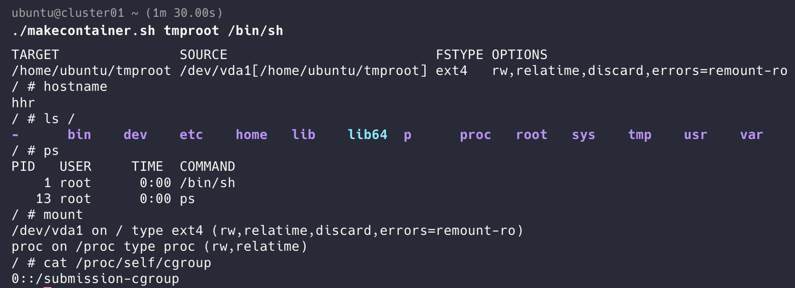
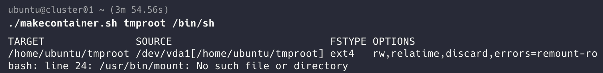

# **심화 질문**

### 1. `pivot_root` 후 이전 루트를 `put_old`에서 분리하는 이유는 무엇일까?

컨테이너의 새로운 rootfs에서 이전 루트 파일 시스템으로 접근할 수 있는 경로를 제거한다. 이전 루트는 `put_old`에 남아있기 때문에 `unmount` 하지 않으면 컨테이너에서 이전 루트 파일 시스템으로 접근할 수 있다.

`unmout`를 해서 새로운 rootfs만 사용도록 한다.

### 2. namespace와 cgroup은 각각 어떤 문제를 해결할까? namespace만 만들고 cgroup을 만들지 않으면 부하가 큰 프로세스에서 무엇이 달라질까?

namespace는 프로세스, hostname, mount 등 볼 수 있는 범위(실행 환경)을 제한하고, cgroup은 CPU, 메모리 같은 시스템의 자원 사용량을 제한하고 관리한다. namespace만 만들고 cgroup을 만들지 않으면 격리는 가능하지만 자원은 제한할 수 없다. 부하가 큰 프로세스가 CPU를 과하게 사용하면 다른 프로세스의 자원 사용에 영향을 줄 수 있다.

### 3. rootfs·namespace·cgroup을 사람이 순서대로 설정하는 대신 runtime이 처리하려면 부모와 자식 프로세스가 각각 어떤 일을 맡아야 할까?

부모 프로세스는 namespace, cgroup을 생성해서 자원 제한을 설정하고 자식 프로세스를 cgroup에 등록한다. 자식 프로세스는 새로운 namespace에서 rootfs를 설정하고 `pivot_root` 를 실행한다.

### 4 . 3주차의 스크립트에서 `pivot_root`와 이전 루트 정리까지 수행하도록 추가하여 제출해주세요. rootfs와 실행할 명령을 인자로 받으면 됩니다. 예: `sudo ./makecontainer.sh /home/ubuntu/tmproot /bin/sh`

```bash
#! /bin/bash

ROOTFS=$1
shift
CMD="$@"

# cgroup 생성
sudo mkdir -p /sys/fs/cgroup/submission-cgroup

sudo unshare --uts --pid --fork --mount bash -c "
	
	echo 0 > /sys/fs/cgroup/submission-cgroup/cgroup.procs

	mount --make-rprivate /
	
	# mount point 만들기
	mount --bind $ROOTFS $ROOTFS
	findmnt --target $ROOTFS
	
	# 이전 호스트 옮길 위치
	mkdir -p $ROOTFS/put_old
	
	cd $ROOTFS
	
	pivot_root . put_old
	cd /
	
	# Bash가 기억하는 기존 명령어 경로 초기화
	hash -r
	
	# put_old 분리 후 경로 삭제
	umount -l /put_old
	rmdir /put_old
	
	# 현재 proc, sys 마운트
	mount -t proc proc /proc
	
	# hostname 변경
	hostname hhr
	
	exec $CMD
"
```




---
<aside>



bash가 pivot_root 이전에 캐싱된 명령어 경로를 사용하여 발생하는 오류

→ `hash -r` 을 사용해서 리셋해준다.

</aside>
