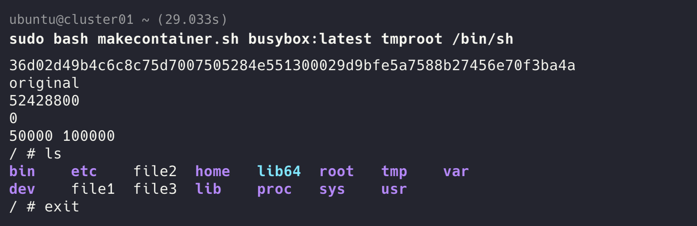

## 1. image 명을 받아 컨테이너를 실행할 수 있도록 스크립트를 만들어서 제출해주세요! (네트워크 같은 것들은 너무 복잡해질 수 있어 제외해도 좋습니다)

```bash
cat makecontainer.sh
#! /usr/bin/env bash

image_name=$1
rootfs=$2

shift 2

# tmproot 디렉터리 생성 (사용할 이미지)
mkdir -p "$rootfs"
cid=$(sudo docker create "$image_name")
sudo docker export "$cid" | sudo tar -C "$rootfs" -xf -
sudo docker rm -v "$cid"

# OverlayFS 적용
mkdir -p  upper work merged
printf 'original\n' | sudo tee "$rootfs"/file1 "$rootfs"/file2 "$rootfs"/file3

sudo mount -t overlay overlay \
	-o lowerdir="$PWD/$rootfs",upperdir="$PWD/upper",workdir="$PWD/work" \
	"$PWD/merged"

# cgroup 생성
sudo mkdir -p /sys/fs/cgroup/week6-cgroup

# 메모리 제한
echo 52428800 | sudo tee /sys/fs/cgroup/week6-cgroup/memory.max
echo 0 | sudo tee /sys/fs/cgroup/week6-cgroup/memory.swap.max

# 프로세스 제한
echo '50000 100000' | sudo tee /sys/fs/cgroup/week6-cgroup/cpu.max

merged="$PWD/merged"

sudo unshare --uts --pid --fork --mount bash -c '
	merged=$1
	shift
	
	echo 0 > /sys/fs/cgroup/week6-cgroup/cgroup.procs

	mount --make-rprivate /

	# pivot_root 실행
	mkdir -p "$merged"/put_old
	cd "$merged"

	pivot_root . put_old
	cd /

	# 기존 명령어 경로 초기화
	hash -r

	# put_old 격리 후 제거
	umount -l /put_old
	rmdir /put_old

	# proc 마운트
	mount -t proc proc /proc

	hostname hhr

	exec "$@"
' container-init "$merged" "$@"
```



## 2. 그림의 `file2`가 lowerdir와 upperdir에 모두 있을 때 어느 파일을 읽을까요? 이 실습에서 원본 `tmproot`를 직접 `/`로 사용하면 무엇이 달라질까요?

upperdir의 파일을 읽는다. tmproot를 직접 루트로 직접 사용하면 변경하거나 삭제했던 파일들이 tmproot에 그대로 반영된다.


## 3. 셸을 종료하는 것, OverlayFS를 unmount하는 것, upper를 삭제하는 것은 파일 변경분에 각각 어떤 영향을 줄까요?

셸 종료는 영향을 주지 않는다. 마운트된 상태와 물리적인 upper 디렉터리가 유지된다.

OverlayFS umount하면 merged만 닫히고 변경된 파일은 호스트의 upper 파일에 남아있다. 나중에 다시 마운트하면 수정했던 상태 그대로 사용할 수 있다. 도커 컨테이너를 멈춘 상태와 비슷하다.

upper를 삭제하면 파일 변경분이 삭제된다. 다시 실행하면 원본(tmproot)만 있는 상태로 실행된다.


## 4. namespace와 OverlayFS를 적용한 스크립트는 프로세스의 자원 사용량과 특권도 제한할까요? 각각 어떤 기능이 더 필요할까요?

프로세스의 자원 사용량이나 특권을 제한하지 않는다. 자원 사용량을 제한하기 위해서 4주차에 진행했던 것처럼cgroup을 만들고 프로세스를 넣어서 제한한다. 특권을 제한하기 위해서 `setpriv` 명령어로 capabilities를 제거하거나, `unshare -U --map-root-user`옵션으로 사용자 네임스페이스를 분리하여 권한을 제한한다.