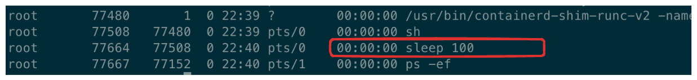

# 1주차: 컨테이너를 위한 Linux

## 이번 주 목표

- 모든 것들은 파일이다

- 프로세스

- 컨테이너도 결국 Linux 프로세스다

## 핵심 개념

### everything is file in linux

리눅스에서 많은 것들은 파일이거나 파일과 비슷한 인터페이스로 표현됩니다. 디렉토리도 파일이나 디렉토리를 담을 수 있는 파일입니다.

[리눅스 디렉토리 구조 한눈에 정리](https://inpa.tistory.com/entry/LINUX-📚-리눅스-디렉토리-구조)


심지어 프로세스도 파일과 같은 표현 형태로 확인할 수 있습니다. 아래 명령어를 수행해봅시다.

```sh
ls /proc
```

숫자로 된 디렉터리는 현재 PID namespace에서 보이는 프로세스를 나타냅니다. 그 밖에는 시스템 정보와 커널 설정, 현재 프로세스를 가리키는 `/proc/self` 등이 있습니다.

```sh
cat /proc/cpuinfo
cat /proc/meminfo
```

> ✅ 제공받은 VM의 사양은 어떻게 되는지 확인해보세요

### Process

프로그램은 디스크에 저장된 실행 파일. 프로그램을 실행하면 (메모리에 올리면) `프로세스`라고 볼 수 있습니다. 프로세스는 운영체제에 의해 관리되며 다음의 메타 정보들을 갖고 있습니다.

- pid : process 식별자
- ppid : 부모 프로세스의 pid

부모가 있다는 말은, 프로세스 역시 tree 구조라는 것을 유추해볼 수 있습니다!


이때 부모 프로세스가 자식 프로세스를 만드는 과정에서 사용되는 시스템 함수 중 대표적인게 `fork()`입니다. fork 시점에 자식 프로세스가 부모 프로세스의 메모리 상태를 복제하여 생성하고, **새로운 pid를 할당**합니다. (따라서 pid는 프로세스 식별자가 될 수 있음)

exec()는 호출한 현재 프로세스를 새로운 프로그램으로 교체합니다. 새로운 프로세스를 만들지 않기 때문에 PID는 유지됩니다.

> ✅ ps -ef 로 현재 확인 가능한 모든 프로세스를 볼 수 있어요
>
> ✅ pstree -p 명령어를 실행해보고, 프로세스의 계층적 구조를 확인해보세요

[fork() 시스템 호출 튜토리얼](https://www.youtube.com/watch?v=xVSPv-9x3gk)


#### 우리가 사용하는 shell도 프로세스입니다

shell은 외부 명령을 실행할 때 자식 프로세스를 `fork()`하고, 자식이 `exec()`를 호출해 대상 프로그램으로 교체됩니다. `cd` 같은 shell builtin은 보통 현재 shell에서 직접 실행됩니다.

`$$`는 현재 셸의 pid를 나타내는 예약어입니다.

```sh
root@container-test:~# echo $$
68213
```

`pstree -p`로 1번 프로세스부터 어떤 계층 구조를 갖는지 확인 가능합니다. 68213 pid의 bash 셸을 확인할 수 있습니다.

```
root@container-test:~# pstree -p
systemd(1)─┬─ModemManager(37345)─┬─{ModemManager}(37354)
...
           ├─sshd(58570)───sshd(68148)───sshd(68198)───bash(68199)───sudo(68208)───sudo(68211)───su(68212)───bash(68213)───pstree(76748)
           ├─unattended-upgr(848)───{unattended-upgr}(927)
           └─zabbix_agentd(36884)─┬─zabbix_agentd(36887)
                                  └─zabbix_agentd(36888)
```


## 컨테이너도 리눅스 Process이다.

`busybox` image로 container를 생성해보고 위 명령어(*`ls /proc/`, `echo $$`, `ps -ef`, `pstree -p`)들을 쳐봅시다.

```sh
docker run -it --rm busybox sh
```

컨테이너에서 실행한 결과와 호스트에서 실행한 결과를 비교해봅니다! (셸을 동시에 2개 띄워놓고 보면 좋을 것 같아요)

```sh
ps -ef
```

그리고 컨테이너에서 `sleep 100`을 하고 host에서 다시 확인해봅니다. 이는 100초간 sleep 상태로 대기하는 프로세스입니다.



컨테이너의 프로세스가 호스트에서도 확인되는 걸 확인할 수 있습니다.

## 체크리스트

- [ ] 제공받은 VM에 접근하기
- [ ] fork 이후에 부모와 자식이 서로 다른 PID를 갖는 것을 확인
```sh
echo "shell pid: $$"
sleep 100 &  # 100초간 sleep 하되, 기다리지 않고 shell로 돌아온다
echo "sleep pid: $!" # $! : 최근에 실행한 백그라운드 프로세스의 pid (sleep의 pid)
ps -o pid,ppid,comm
```
- [ ] 프로그램과 프로세스, PID와 PPID를 구분할 수 있다.
- [ ] 호스트에서 컨테이너 프로세스를 찾고 내부 PID와 매칭시켰다.

## 심화 질문

1. `/proc/<PID>`는 실제 저장된 파일일까?
2. 자식 프로세스가 종료된 뒤 부모가 종료 상태를 회수해야 하는 이유는 무엇이며, 이때 어떤 system call을 사용할까?
3. 호스트에서는 컨테이너 프로세스가 보이는데, 컨테이너에서는 대부분의 호스트 프로세스가 보이지 않는 이유는 무엇일까?

