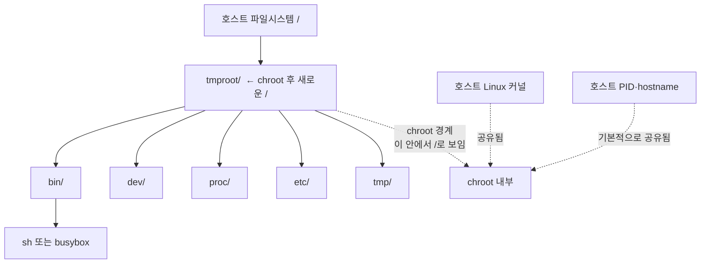

# 2주차: 이미지에서 rootfs 꺼내기

## 이번 주 목표

- 이미지와 rootfs의 차이 알아보기
- `chroot`로 프로세스가 보는 `/` 바꿔 보기

## 핵심 개념

### 1주차의 BusyBox 다시 보기

1주차에서는 다음 명령으로 BusyBox 컨테이너를 실행했습니다.

```bash
sudo docker run --rm -it busybox sh
```

여기서 `busybox`는 Docker가 컨테이너를 만드는 데 사용한 **이미지 이름**입니다. 이미지에는 `/bin/sh`, `ls`처럼 컨테이너에서 사용할 명령과 파일이 들어 있습니다.

이번에는 Docker가 준비해주던 파일을 `tmproot`라는 디렉터리에 직접 꺼내봅니다. 이후 프로세스가 이 디렉터리를 `/`로 보게 만들 것입니다. 이처럼 프로세스가 `/`로 사용하는 파일 묶음을 **rootfs(root filesystem)**라고 합니다.

### `chroot`로 `/` 바꾸기

`chroot`는 프로세스가 파일을 찾는 기준 경로를 바꿉니다. `chroot tmproot`로 실행하면 `tmproot/bin/sh`가 그 프로세스에게는 `/bin/sh`로 보입니다. hostname이나 PID, 네트워크까지 분리해주지는 않습니다.

1주차에서 본 `/proc`은 커널이 제공하는 가상 파일 시스템입니다. export한 rootfs에서는 비어 있을 수 있고, 사용하려면 별도로 mount해야 합니다.

## 실습 준비

VM에서 `sudo docker info`와 `chroot --version`이 성공하는지 확인합니다.

- 기본 영상: [카카오 핸즈온 21:15~41:04](https://www.youtube.com/watch?v=lVtgqmjv4BQ&t=1275s)
- [Docker `container export` 명령어](https://docs.docker.com/reference/cli/docker/container/export/)
- [iximiuz: How Container Filesystem Works](https://labs.iximiuz.com/tutorials/container-filesystem-from-scratch) => 이해할 수 있는 부분만 skim 해봅시다!

## 실습

### 1. 호스트와 Docker 컨테이너의 `/` 비교

```bash
uname -a # 커널 이름, 버전 정보 조회
ls / # 루트 디렉토리 정보 조회
findmnt / # 루트 디렉토리 마운트 정보 조회
# 호스트에서 아래 명령을 실행하면 컨테이너 안에서 정보를 출력합니다.
sudo docker run --rm busybox sh -c 'uname -a; ls /; ls -l /bin/sh'
```

> 확인: `uname -a`에서 같은 부분과 다른 부분을 찾아보세요. `/`의 파일 목록은 어떤가요?

### 2. BusyBox 컨테이너의 파일 꺼내기

먼저 `docker create`로 BusyBox 이미지에서 컨테이너를 생성합니다. 이때 파일과 설정은 준비되지만 프로세스는 시작되지 않습니다. `docker export`가 내보낸 tar 데이터를 `tmproot`에 풀고, 임시 컨테이너는 삭제합니다.

```bash
mkdir -p tmproot
cid=$(sudo docker create busybox)
# 컨테이너의 파일을 tar 형식으로 내보내 tmproot에 풉니다.
sudo docker export "$cid" | sudo tar -C tmproot -xf -
sudo docker rm "$cid"
sudo du -sh tmproot
sudo ls tmproot
sudo ls -l tmproot/bin/sh
```

지금 `tmproot`는 호스트에 만든 평범한 디렉터리입니다.

### 3. `chroot`로 루트 파일시스템 변경

`chroot`(change root)는 실행할 프로세스가 사용하는 루트 디렉터리를 바꿉니다. 새 셸이 `tmproot`를 `/`로 사용하도록 실행해봅시다!

```bash
hostname
echo $$ # 현재 셸 프로세스의 pid 출력
sudo chroot tmproot /bin/sh # tmproot를 rootfs로 shell 실행
```
BusyBox의 파일 구조를 사용하는 Linux가 떠 있는 것처럼 보입니다. 실제로는 같은 커널에서 새 셸을 실행한 것입니다. 아래 명령은 이 셸 안에서 실행합니다.

```bash
# 기존 루트 디렉토리로 갈 수 있을까요?
pwd
cd ..
pwd

# 호스트와 정보가 같은지 비교해봅시다
ls /
hostname
echo "pid=$$"
ls /proc
ps
```

> 확인: `tmproot` 안의 파일이 `/` 아래에 보이나요? hostname은 호스트와 같은가요? `/proc`은 다른가요?

`chroot`로 `docker run -it busybox /bin/sh`와 비슷한 화면을 만들었습니다. 하지만 `/proc`은 비어 있고 `ps`도 프로세스 목록을 제대로 읽지 못합니다. 프로세스가 격리된 걸까요? procfs를 마운트하고 다시 확인해봅시다.

### 4. `/proc` & `ps`

**procfs**는 커널이 프로세스와 시스템 정보를 파일처럼 보여주는 가상 파일 시스템입니다. 1주차에서 본 `/proc/cpuinfo`, `/proc/meminfo`, `/proc/<PID>`도 여기서 제공하며, 읽을 때 커널의 현재 정보를 확인할 수 있습니다.

`/proc`은 이 정보를 볼 디렉터리이고, procfs는 그곳에 마운트할 파일 시스템입니다. `ps`도 여기서 프로세스 정보를 읽습니다. `docker export`에는 실행 중인 procfs의 내용이 포함되지 않으므로, 지금 `tmproot/proc`는 빈 디렉터리입니다.

먼저 chroot 셸을 종료해 호스트 셸로 돌아옵니다.

```bash
exit
```

호스트에서 `tmproot/proc`에 procfs를 마운트합니다.

```bash
sudo mkdir -p tmproot/proc
sudo mount -t proc proc tmproot/proc
findmnt -T tmproot/proc
```
`tmproot/proc`에 procfs를 새로 마운트했습니다. 다음은 출력 예시이며, 경로는 실습 위치에 따라 다릅니다.

```text
TARGET                    SOURCE FSTYPE OPTIONS
/home/ubuntu/tmproot/proc proc   proc   rw,relatime
```

이제 chroot로 다시 들어가서 `/proc`과 `ps`를 확인합니다.

```bash
sudo chroot tmproot /bin/sh
ls /proc
ps
```
호스트 프로세스가 보입니다. 호스트의 `ps`와 BusyBox의 `ps`는 기본 출력 형식과 표시 대상이 다를 수 있으므로, 출력 전체보다 PID와 명령 이름을 비교하세요.

> 호스트와 같은 PID namespace에서 procfs를 마운트했으므로 호스트 프로세스가 보입니다. 마운트 전에도 프로세스가 격리된 것은 아닙니다. 
> PID namespace는 다음주에 다뤄보겠습니다.

실습이 끝나면 chroot 셸에서 나옵니다.

```bash
exit
```

호스트에서 procfs를 정리하고 확인합니다. 마지막 명령은 아무것도 출력되지 않아야 합니다.

```bash
sudo umount tmproot/proc
findmnt --mountpoint tmproot/proc
```

chroot는 프로세스가 사용하는 rootfs를 바꿔주는 기능이며, 그 자체로 완전한 컨테이너 격리를 제공하지는 않는다고 볼 수 있습니다.



`tmproot` 디렉터리는 다음 주에도 사용하므로 남겨둡시다.

## 체크리스트

- [ ] BusyBox 컨테이너의 파일을 `tmproot`에 꺼냈다.
- [ ] chroot 안의 /bin/sh는 tmproot에 꺼낸 BusyBox의 셸이라는 것을 확인했다.
- [ ] `/`에서 `cd ..`를 해도 호스트의 상위 디렉터리로 이동하지 않는 것을 확인했다.
- [ ] procfs 마운트 전후의 `/proc`과 `ps`를 비교하고, 호스트 프로세스가 보이는 이유를 설명할 수 있다.
- [ ] chroot 셸을 종료하고 procfs와 임시 Docker 컨테이너를 정리했다.

## 심화 질문

1. BusyBox 이미지, `docker create`로 만든 컨테이너, 파일을 꺼낸 `tmproot`는 어떤 관계일까?
2. procfs를 마운트한 뒤 `ps`에 호스트 프로세스가 보이는 이유는 무엇일까? 마운트 전에는 프로세스가 격리돼 있었던 걸까?
3. `cd ..`로 밖에 나갈 수 없는데도 `chroot`를 안전한 격리 장치라고 할 수 없는 이유는 무엇일까? 남아 있는 권한이나 이미 열린 파일을 단서로 생각해보자.
