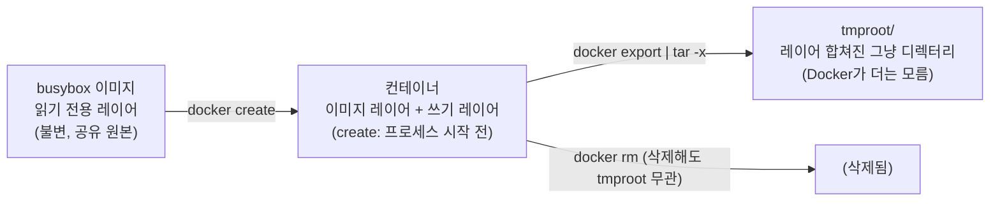
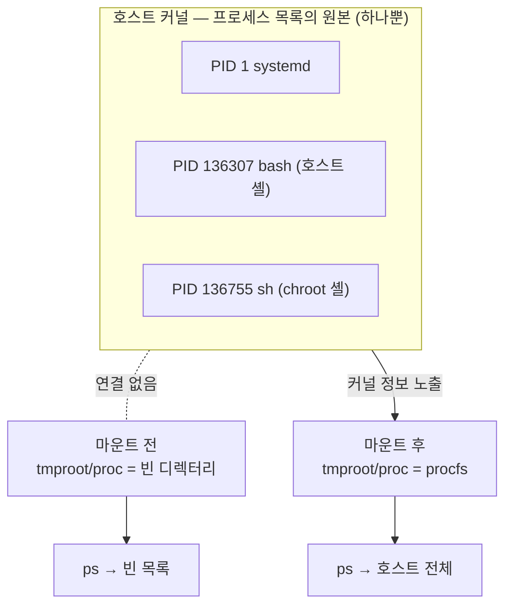
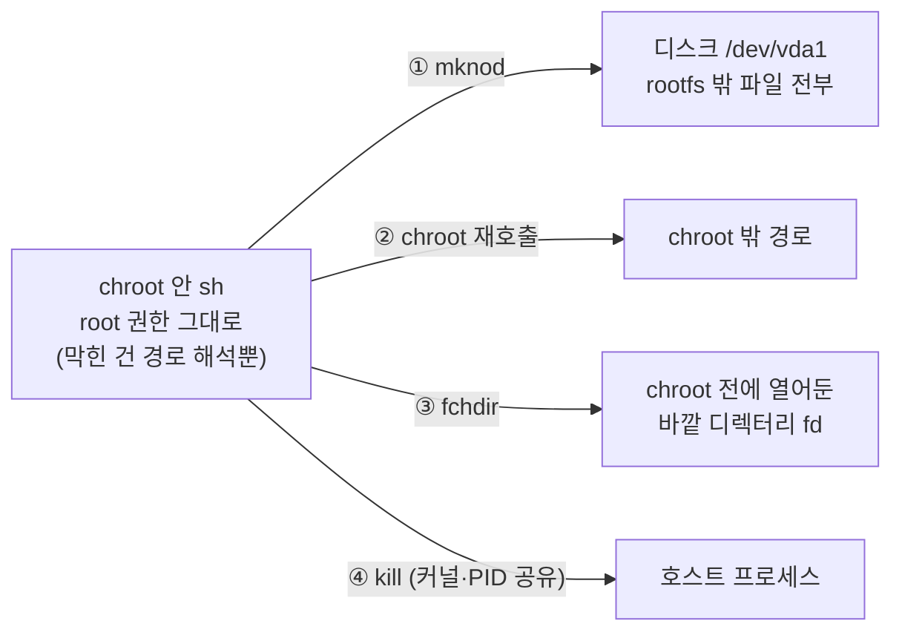

# 2주차: 이미지에서 rootfs 꺼내기 — 실습 정리

환경: Ubuntu VM (cluster06, kernel 5.15.0-190-generic, x86_64)

## 1. 호스트와 컨테이너의 `/` 비교

호스트:

```text
$ uname -a
Linux cluster06 5.15.0-190-generic #200-Ubuntu SMP Fri Aug 7 15:06:04 UTC 2026 x86_64 x86_64 x86_64 GNU/Linux
$ ls /
bin  boot  dev  etc  home  lib  lib32  lib64  libx32  lost+found  media  mnt  opt  proc  root  run  sbin  snap  srv  sys  tmp  usr  var
$ findmnt /
TARGET SOURCE    FSTYPE OPTIONS
/      /dev/vda1 ext4   rw,relatime,discard,errors=remount-ro
```

컨테이너:

```text
$ sudo docker run --rm busybox sh -c 'uname -a; ls /; ls -l /bin/sh'
Linux 84b3cc5ed77d 5.15.0-190-generic #200-Ubuntu SMP Fri Aug 7 15:06:04 UTC 2026 x86_64 GNU/Linux
bin  dev  etc  home  lib  lib64  proc  root  sys  tmp  usr  var
-rwxr-xr-x  411 root  root  1041984 May 13 02:21 /bin/sh
```

확인 결과:

- **같은 부분**: 커널 버전 문자열 전체(`5.15.0-190-generic #200-Ubuntu ...`). 컨테이너가 OS를 따로 부팅한 게 아니라 호스트 커널을 그대로 쓴다.
- **다른 부분**: hostname 자리 — 호스트는 `cluster06`, 컨테이너는 컨테이너 ID(`84b3cc5ed77d`). `x86_64`가 한 번만 나오는 건 busybox `uname`이 출력하는 필드가 적어서일 뿐.
- **`/` 목록**: 호스트는 `boot`, `snap`, `media`, `run`까지 있는 풀 Ubuntu 구조인데 컨테이너는 이미지에 담긴 12개 디렉터리가 전부.
- **`/bin/sh`의 링크 수 411**: busybox는 `ls`, `ps` 같은 명령이 전부 1MB짜리 `busybox` 단일 바이너리에 대한 하드링크다. 이미지가 몇 MB밖에 안 되는 이유.

## 2. BusyBox 컨테이너의 파일 꺼내기

```text
$ mkdir -p tmproot
$ cid=$(sudo docker create busybox)
$ sudo docker export "$cid" | sudo tar -C tmproot -xf -
$ sudo docker rm "$cid"
$ sudo du -sh tmproot
4.4M	tmproot
$ sudo ls tmproot
bin  dev  etc  home  lib  lib64  proc  root  sys  tmp  usr  var
$ sudo ls -l tmproot/bin/sh
-rwxr-xr-x 411 root root 1041984 May 13 11:21 tmproot/bin/sh
```

- `docker create`는 `docker run`과 달리 프로세스를 시작하지 않고 컨테이너(파일+설정)만 만든다. `docker export`가 그 파일시스템 전체를 tar 스트림으로 내보내고, 파이프로 바로 `tmproot`에 풀었다.
- `tmproot` 목록이 1번에서 컨테이너의 `ls /`와 정확히 일치 — 컨테이너의 `/` 전체가 호스트의 평범한 디렉터리로 나온 것.
- `tmproot/bin/sh`는 컨테이너의 `/bin/sh`와 같은 파일(크기 1041984, 링크 수 411 일치). 시각이 02:21 vs 11:21로 달라 보이는 건 컨테이너는 UTC, 호스트는 KST 표시 차이.
- "리눅스 한 벌"처럼 보여도 전체 4.4MB — 실체는 busybox 바이너리 하나 + 하드링크 411개 + 설정 파일 몇 개.
- 삽질 메모: docker 명령에 `sudo`를 안 붙이면 `permission denied ... docker.sock` — 소켓이 root 소유라서다. 그리고 1번의 `docker run -it busybox sh` 셸 안에서 2번 명령을 치면 당연히 안 된다(컨테이너 안에는 `docker`도 없고 `tmproot`도 없음). 프롬프트가 `ubuntu@cluster06:~$`인지 `/ #`인지부터 확인할 것.

## 3. chroot로 루트 파일시스템 변경

들어가기 전 호스트:

```text
$ hostname
cluster06
$ echo $$
136307
```

chroot 안:

```text
$ sudo chroot tmproot /bin/sh
/ # pwd
/
/ # cd ..
/ # pwd
/
/ # ls /
bin    dev    etc    home   lib    lib64  proc   root   sys    tmp    usr    var
/ # hostname
cluster06
/ # echo "pid=$$"
pid=136704
/ # ls /proc          (빈 출력)
/ # ps
PID   USER     TIME  COMMAND      (헤더만, 목록 없음)
```

확인 결과:

- **`ls /` = tmproot 내용물**. 이 프로세스에게는 tmproot가 곧 `/`다.
- **`cd ..`를 해도 `pwd`가 계속 `/`** — 경로 탐색의 상한이 tmproot로 바뀌어서 그 위로는 못 올라간다.
- **hostname은 호스트와 동일** — chroot는 경로 해석 기준만 바꾸고 hostname·PID·네트워크는 호스트와 그대로 공유한다. `docker run`에서는 hostname이 컨테이너 ID로 바뀌었던 것과 대비되는 지점.
- **pid=136704** — 격리됐다면 1이어야 하는데 호스트 번호 체계(13만번대)를 그대로 이어받았다. 호스트 셸(136307)과 번호가 다른 건 단지 새로 뜬 프로세스라서고, 같은 프로세스 트리에 있다.
- **`/proc`이 비어 있고 `ps`도 빈 이유**: `docker export`에는 procfs 내용이 담기지 않아 `tmproot/proc`은 그냥 빈 디렉터리다. `ps`는 `/proc`을 읽어서 목록을 만드는 조회 클라이언트일 뿐이라, 데이터 소스가 없으니 빈 결과가 나온다. 격리돼서가 아니다.

## 4. /proc 마운트 & ps

호스트에서 procfs 마운트:

```text
$ sudo mkdir -p tmproot/proc
$ sudo mount -t proc proc tmproot/proc
$ findmnt -T tmproot/proc
TARGET                    SOURCE FSTYPE OPTIONS
/home/ubuntu/tmproot/proc proc   proc   rw,relatime
```

chroot 다시 들어가서:

```text
/ # ls /proc
1  2  3 ... 136307 ... 136755 ...  cpuinfo  meminfo  mounts  ...
/ # ps
PID   USER     TIME  COMMAND
    1 root      0:29 /lib/systemd/systemd --system --deserialize 41
  701 root      3:36 /usr/bin/dockerd -H fd:// ...
136307 1000     0:00 -bash
136753 root     0:00 sudo chroot tmproot /bin/sh
136755 root     0:00 /bin/sh
136760 root     0:00 ps
```

여기서 본 것 3가지:

1. **`ps`의 1번이 호스트의 systemd** — 격리된 컨테이너라면 1번이 자기 자신(sh)이어야 한다.
2. **마운트 전에 호스트에서 찍어둔 bash(136307)가 목록에 그대로** — chroot 안에서 호스트 프로세스가 전부 보인다. 같은 PID namespace라는 뜻.
3. **chroot 셸 자신(136755)도 그 목록 안에 있음** — "chroot 안"이 별개 세계가 아니라 호스트 프로세스 트리의 한 노드일 뿐이다.

마운트 전의 빈 `ps`는 격리가 아니라 데이터 소스 부재였다. procfs를 붙이는 순간 커널이 아는 전부(=호스트 전체)가 그대로 조회된다.

정리:

```text
/ # exit
$ sudo umount tmproot/proc
$ findmnt --mountpoint tmproot/proc      (출력 없음 = 정리 완료)
```

`tmproot`는 다음 주(namespace)에도 쓰므로 남겨둠.

## 체크리스트

- [x] BusyBox 컨테이너의 파일을 `tmproot`에 꺼냈다 — `du -sh` 4.4M, 목록이 컨테이너 `ls /`와 일치
- [x] chroot 안의 `/bin/sh`는 tmproot에 꺼낸 BusyBox 셸 — 크기(1041984)·링크 수(411) 동일
- [x] `/`에서 `cd ..`를 해도 호스트 상위로 못 나감 — `pwd`가 계속 `/`
- [x] procfs 마운트 전후 비교 — 전: `/proc` 빈 디렉터리·`ps` 빈 목록 / 후: 호스트 프로세스 전체. 같은 커널·같은 PID namespace라서
- [x] chroot 셸 종료, procfs umount(`findmnt` 빈 출력), 임시 컨테이너 `docker rm` 완료

## 심화 질문

**1. 이미지 / `docker create`한 컨테이너 / `tmproot`의 관계는?**

셋 다 같은 busybox 파일들, 상태만 다르다.

- **이미지** = 읽기 전용 원본. 컨테이너를 몇 개 만들든 불변.
- **컨테이너** = 이미지 + 쓰기 레이어 1장. `create`는 여기까지, 프로세스는 시작 전(`run` = create + start).
- **tmproot** = 레이어를 합쳐 꺼낸 그냥 디렉터리. export 이후로는 Docker와 무관.



git으로 치면: 이미지 = 커밋, 컨테이너 = 워킹트리, tmproot = `.git` 없이 폴더째 복사한 것.

**2. procfs 마운트 후 `ps`에 호스트 프로세스가 보이는 이유는? 마운트 전에는 격리돼 있었나?**

프로세스 목록의 원본은 커널에 하나뿐. `/proc`은 그 목록을 파일 형태로 노출하는 인터페이스고, `ps`는 `/proc`을 읽어서 출력할 뿐이다.



- **보이는 이유**: 같은 커널·같은 PID namespace라서, 창문을 달면 커널이 아는 전부(=호스트 전체)가 보인다.
- **마운트 전에도 격리는 없었다**: 빈 `ps`는 창문이 없었을 뿐. 근거 — chroot 안 `$$`가 1이 아닌 136704(호스트 번호 연속), chroot 셸(136755)이 호스트 목록에 그대로 있음.

**3. `cd ..`로는 못 나가는데 왜 chroot를 안전한 격리 장치라고 할 수 없나?**

chroot가 잠그는 건 "경로 해석 기준" 하나뿐. 나머지는 다 열려 있다.



- ① root면 `mknod`로 디스크 장치를 만들어 rootfs 밖 파일을 통째로 읽을 수 있다.
- ② root면 chroot를 재호출해 경계를 옮기며 탈출할 수 있다(고전 기법).
- ③ chroot 전에 열어둔 fd는 `fchdir`로 경로를 안 거치고 밖으로 이동한다 — 막힌 건 경로 문자열뿐.
- ④ 커널·PID·네트워크 공유 — 밖 프로세스에 kill 가능, procfs 하나 붙였다고 호스트 전체가 보인 게 4번 실습.

결론: chroot는 격리가 아니라 "경로 기준 변경". 실제 컨테이너 = pivot_root + **namespace(다음 주)** + cgroup + capability 축소.
