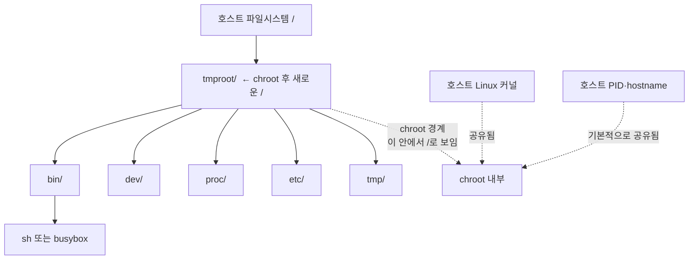

# 1. 호스트와 Docker / 비교

```bash
uname -a # 커널 이름, 버전 정보 조회
ls / # 루트 디렉토리 정보 조회
findmnt / # 루트 디렉토리 마운트 정보 조회
# 호스트에서 아래 명령을 실행하면 컨테이너 안에서 정보를 출력합니다.
sudo docker run --rm busybox sh -c 'uname -a; ls /; ls -l /bin/sh'
```

## `Uname` 비교

### Host


### Docker


→ hostname 이 다르다 `cluster01` vs `7476….ac3`

## `ls /`

### Host


### Docker


→ 컨테이너의 디렉터리 종류가 더 적음

## `findmnt /`

### Host


### Docker


# 2. **BusyBox 컨테이너의 파일 꺼내기**

- 💥 `docker export`

  | Description | 컨테이너의 파일시스템을 tar 아카이브로 내보낸다. |
  | --- | --- |
  | Usage | **`docker container export [OPTIONS] CONTAINER`** |
  | Aliases | **`docker export`** |

  - 컨테이너와 연관된 볼륨의 내용은 내보내지 않는다.
  - 디렉터리에 볼륨이 마운트되어 있다면, docker export는 볼륨의 내용을 가져오는 것이 아니라 원래 존재하던 디렉터리의 내용을 내보낸다.
  - 그래서 볼륨의 백업, 복원은 별도로 진행해야 한다.

```bash
mkdir -p tmproot
cid=$(sudo docker create busybox)
sudo docker export "$cid" | sudo tar -C tmproot -xf -
sudo docker rm "$cid"
sudo du -sh tmproot
sudo ls tmproot
sudo ls -l tmproot/bin/sh
```


> 컨테이너 이미지 안에 있는 `rootfs`를 `docker export`를 통해 가져오지 않으면 `/bin` 디렉터리 안에 있는 실행 파일들을 하나하나 다 복사해서 옮기고 디렉터리도 만들어야 한다.
>
> 도커 이미지를 사용하는 장점을 체감할 수 있다.


# **3. `chroot`로 루트 파일시스템 변경**


hostname은 호스트와 같다. `/` 아래 파일은 도커로 busybox를 띄웠을 때와 같다. `/proc`는 비어있다.

# **4. `/proc` & `ps`**

```bash
sudo mkdir -p tmproot/proc
sudo mount -t proc proc tmproot/proc
findmnt -T tmproot/proc
```

procfs를 마운트한다.


다시 tmproot로 돌아가서 확인.


### tmproot


### Host


**tmproot**에서 호스트의 프로세스가 보인다.

→ 마운트는 가상 파일 시스템이나 디스크를 원하는 폴더에 연결하는 작업이다. USB를 꽂아서 내부 데이터를 보는 것과 동일하다.

→ `chroot`는 프로세스가 바라보는 루트 디렉터리(`/`)를 변경한다. 프로세스 입장에서는 tmproot가 새로운 루트 디렉터리(`/`)인 것처럼 보인다. 하지만 PID, hostname, 네트워크 등을 완전히 격리하지 않는다.



---

## 1. BusyBox 이미지, `docker create`로 만든 컨테이너, 파일을 꺼낸 `tmproot`는 어떤 관계일까?

```text
이미지 → (create) → 컨테이너 → (export) → tmproot
```

BusyBox 이미지는 컨테이너를 만들기 위한 파일과 설정을 가지고 있고 `docker create`를 하면 컨테이너가 생성된다. `docker export`를 통해서 컨테이너의 파일시스템 내용(`rootfs`)을 tar 아카이브로 내보내 `tmproot` 디렉터리에 푼다.

tmproot는 BusyBox 컨테이너의 파일 시스템을 가지고 있는 일반 디렉터리이다. `chroot`를 통해서 프로세스가 루트 디렉터리 `/`로 사용할 수 있다.

- `rootfs`
  - 프로세스가 `/`로 인식하는 파일시스템

```text
/
├── bin/
├── etc/
├── dev/
├── tmp/
└── ...
```

## 2. procfs를 마운트한 뒤 `ps`에 호스트 프로세스가 보이는 이유는 무엇일까? 마운트 전에는 프로세스가 격리돼 있었던 걸까?

처음에는 `tmproot/proc`가 비어있기 때문에 `ps`, `/proc`를 통해 볼 수 없었다.

`procfs`를 `tmproot/proc`에 마운트하면, 호스트 프로세스 정보를 제공하기 때문에 호스트 프로세스를 볼 수 있다. 마운트는 가상 파일 시스템이나 디스크를 원하는 폴더에 연결하는 작업이다. USB를 꽂아서 내부 데이터를 보는 것과 동일하다.

마운트 전에는 프로세스가 격리되어 있던 것이 아니라, 프로세스 정보를 보여주는 `/proc`가 `chroot` 내부에 연결되어 있지 않았던 것이다.

→ PID를 격리하지 않는다.

## 3. `cd ..`로 밖에 나갈 수 없는데도 `chroot`를 안전한 격리 장치라고 할 수 없는 이유는 무엇일까? 남아 있는 권한이나 이미 열린 파일을 단서로 생각해보자.

`hostname`이 같고 호스트의 프로세스를 볼 수 있다는 점에서 완전한 격리장치라고 할 수 없다.

`chroot`는 루트 디렉터리만 격리한다.

### 이미 열린 파일 테스트

#### 1. 호스트에서 `/tmp/host-open.txt` 만들기


#### 2. `tmproot/proc`에 procfs 마운트


#### 3. chroot 실행 및 열린 파일 접근


`exec 3</tmp/host-open.txt` → 현재 셸 fd 3번에 `host-open.txt` 파일을 읽기 전용으로 열어 할당한다.

`chroot /home/ubuntu/tmproot /bin/sh` → 루트 디렉터리를 변경한다. 자식 프로세스는 부모 프로세스의 fd를 상속받는다.

`cat /proc/self/fd/3` → 상속받은 fd 3번을 통해서 chroot 이전에 열어둔 파일에 접근할 수 있다.

tmproot의 `/tmp` 디렉터리 안에는 아무것도 없지만 호스트의 `/tmp/host-open` 파일을 읽어서 “Hello from Host”를 반환한다.