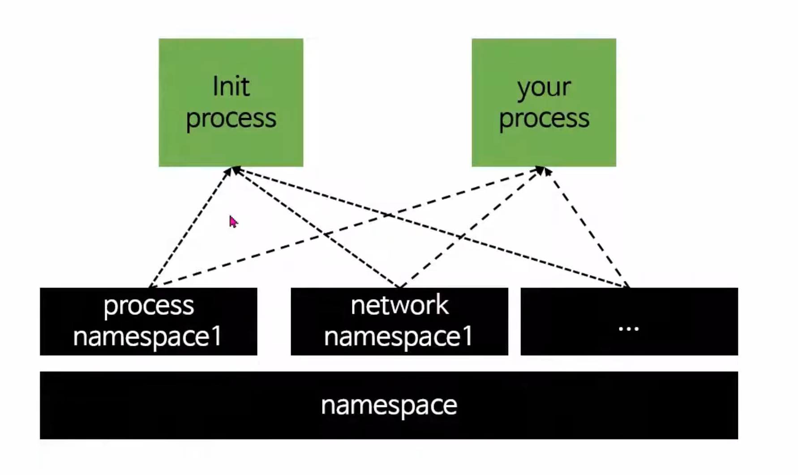
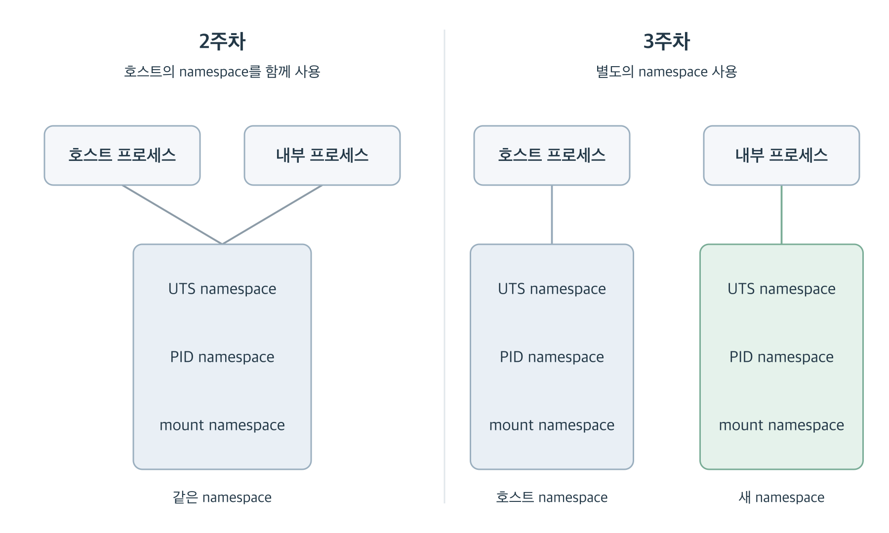

# 3주차: rootfs에 namespace를 더해 격리하기

- 영상: [카카오 핸즈온 45:17~1:00:46](https://www.youtube.com/watch?v=lVtgqmjv4BQ&t=2717s)
- 영상: [카카오 핸즈온 1:15:26~1:33:10](https://www.youtube.com/watch?v=lVtgqmjv4BQ&t=4526s)
- 선택 읽기: [namespace의 종류와 식별 방법](https://man7.org/linux/man-pages/man7/namespaces.7.html), [PID namespace와 procfs](https://man7.org/linux/man-pages/man7/pid_namespaces.7.html)
- 명령어 참고: [`unshare` 옵션](https://man7.org/linux/man-pages/man1/unshare.1.html)

## 이번 주 목표

- 2주차의 `chroot`가 바꾼 것과 namespace로 추가로 분리할 것을 구분하기
- namespace의 동작 방식과 종류를 이해하고 UTS·PID·mount namespace를 직접 나누기
- PID namespace와 `/proc`의 관계를 실험으로 확인하기
- 2주차 rootfs에 namespace를 더해 셸을 실행하고 결과 설명하기

## 핵심 개념

2주차에서는 BusyBox의 파일을 `tmproot`에 저장하고 `chroot`로 셸을 실행했습니다. `/`의 파일 목록은 바뀌었지만 hostname은 여전히 호스트와 같았습니다. procfs를 마운트하니 `ps`에는 호스트 프로세스도 보였습니다.

`chroot`로 파일을 찾는 기준은 바꿨는데, 왜 hostname과 프로세스 목록은 그대로였을까요? 이 정보는 rootfs 안의 파일만으로 정해지는 것이 아니라, 프로세스가 속한 **namespace**에 따라 달라지기 때문입니다.

이번 주의 주제는 **namespace를 이해하고, 지난주의 rootfs에 결합하는 것**입니다. 무엇을 공유하고 무엇을 나눌 수 있는지 알아본 뒤, hostname과 PID, 마운트 구성을 하나씩 분리합니다. 마지막에는 `tmproot`로 셸을 실행해 2주차와 달라진 결과를 확인해봅시다. (내용이 좀 많습니다 ㅠ)

### namespace: 프로세스가 보는 범위를 나누는 기능

namespace는 커널이 관리하는 자원의 이름이나 정보를 프로세스별로 나누어 볼 수 있게 하는 기능입니다. 예를 들어 UTS namespace가 다르면 같은 커널을 쓰면서도 서로 다른 hostname을 사용할 수 있습니다.

호스트의 프로세스에도 UTS, PID, mount 등 종류별 namespace가 연결되어 있습니다. 이렇게 특정 namespace를 사용하는 관계를 그 namespace에 ‘속한다’고 표현합니다. 일반적으로 새로 실행한 자식 프로세스는 부모의 namespace를 물려받으므로, 따로 나누지 않은 셸들은 hostname 등의 정보를 공유합니다.

특정 프로세스가 속하는 namespace는 하나가 아닙니다. **UTS, PID, mount 등 종류별로 존재합니다.** UTS만 새로 나누면 hostname을 따로 바꿀 수 있지만 PID와 마운트 구성은 계속 공유합니다. 우리의 목표는 *필요한 종류를 조합해서 컨테이너의 실행 환경을 만드는 것*입니다.


[출처: 컨테이너 생성 단계 분석 1편 - 리눅스 namespace](https://www.youtube.com/watch?v=EV4LyUJrw5E)

위 그림의 프로세스와 namespace 사이 연결을 직접 확인해봅시다.

```bash
echo $$ # 현재 셸의 PID
ls -l /proc/$$/ns
```

`/proc/<PID>/ns`에는 해당 프로세스가 사용하는 namespace를 가리키는 링크가 있습니다.

```text
lrwxrwxrwx 1 ubuntu ubuntu 0 Sep 15 22:35 cgroup -> 'cgroup:[4026531835]'
lrwxrwxrwx 1 ubuntu ubuntu 0 Sep 15 22:35 ipc -> 'ipc:[4026531839]'
lrwxrwxrwx 1 ubuntu ubuntu 0 Sep 15 22:35 mnt -> 'mnt:[4026531841]'
lrwxrwxrwx 1 ubuntu ubuntu 0 Sep 15 22:35 net -> 'net:[4026531840]'
lrwxrwxrwx 1 ubuntu ubuntu 0 Sep 15 22:35 pid -> 'pid:[4026531836]'
lrwxrwxrwx 1 ubuntu ubuntu 0 Sep 15 22:35 pid_for_children -> 'pid:[4026531836]'
lrwxrwxrwx 1 ubuntu ubuntu 0 Sep 15 22:35 time -> 'time:[4026531834]'
lrwxrwxrwx 1 ubuntu ubuntu 0 Sep 15 22:35 time_for_children -> 'time:[4026531834]'
lrwxrwxrwx 1 ubuntu ubuntu 0 Sep 15 22:35 user -> 'user:[4026531837]'
lrwxrwxrwx 1 ubuntu ubuntu 0 Sep 15 22:35 uts -> 'uts:[4026531838]'
```

자식 Bash를 하나 실행해봅니다. `--norc`는 개인 Bash 설정 파일을 읽지 않고 시작하는 옵션입니다.

```bash
bash --norc
```

**새 Bash 안에서** PID와 세 namespace를 확인합니다. 

```bash
echo "자식 셸 PID=$$"
ls -l /proc/$$/ns
```

> 확인: PID는 같은가요? ns는 모두 같은가요?

부모 셸과 비교하면 **셸의 PID는 다르지만 namespace 식별값은 같습니다.** 새 프로세스를 실행하는 것만으로 namespace까지 새로 만들어지는 것은 아닙니다. 자식이 부모의 namespace를 물려받기 때문입니다.

> 확인: PID가 다른 두 셸이 같은 PID namespace를 사용할 수 있나요? 두 출력에서 그 근거를 찾아보세요.

자식 셸에서 `exit`를 실행해 원래 셸로 돌아옵니다.

```bash
exit
```

### namespace의 종류

주요 namespace의 종류들은 다음과 같습니다.

| 종류 | 분리하는 것 | 비고 |
|---|---|---|
| UTS | hostname 등의 시스템 이름 | 안에서 hostname을 바꿔도 호스트 이름은 유지 |
| PID | 프로세스 번호와 PID로 식별할 수 있는 범위 | 새 namespace의 첫 프로세스는 내부에서 PID 1이 됨 |
| mount | 파일 시스템의 마운트 구성 | 안에서 procfs를 마운트해도 호스트의 마운트 구성은 유지 |
| network | 네트워크 장치, 라우팅 테이블, 포트 등 | 5주차 예정 |
| IPC | System V IPC와 POSIX 메시지 큐 등 프로세스 간 통신 자원 |  |
| user | 사용자·그룹 ID와 그에 따른 권한의 범위 |  |
| cgroup | 프로세스에게 보이는 cgroup 경로의 기준 | 이 namespace 자체가 사용량을 제한하는 것은 아님 |
| time | 단조 시계와 부팅 후 경과 시간 시계의 기준 |  |

종류별 자세한 정의는 [Linux namespace 개요](https://man7.org/linux/man-pages/man7/namespaces.7.html)에서 확인할 수 있습니다. 우선은 “어떤 정보를 따로 갖게 할 것인가(격리할 것인가)?”를 기준으로 각 종류를 구분하세요.

### mount와 `/proc`: 프로세스 목록을 읽는 경로

**마운트(mount)**는 파일 시스템을 특정 디렉터리에 연결하는 작업이며, `mount` 명령어로 수행합니다. `/proc`은 디렉터리 경로이고, **procfs**는 커널 정보를 파일처럼 보여주는 가상 파일 시스템입니다. procfs를 `/proc`에 마운트하면 파일을 디스크에 복사하는 대신, 그 경로를 통해 커널의 정보를 읽게 됩니다.

```text
# mount [옵션] <소스> <마운트 지점>
mount -t proc proc tmproot/proc
```

| 인자 | 의미 |
|---|---|
| `-t proc` | 파일 시스템 종류로 procfs를 지정합니다. |
| 가운데 `proc` | 소스 자리에 관례적으로 적는 이름입니다. (기존 호스트 `/proc` 경로를 뜻하지 않음) |
| `tmproot/proc` | procfs를 연결할 디렉터리입니다. 미리 만들어두어야 합니다. |
|--bind | 기존 디렉터리나 파일을 다른 경로에서도 보이게 연결합니다. (-t와 구분!)|

위의 `mount -t proc proc tmproot/proc`명령어는 **현재 PID namespace 기준의 새 procfs**를 tmproot/proc에 연결합니다. 반면 `mount --bind /proc tmproot/proc`는 **기존 `/proc`**을 연결하므로, 기존 것이 호스트 기준 procfs라면 연결한 경로에서도 호스트 기준 정보를 읽습니다. `umount tmproot/proc`로 연결을 해제하면 마운트 전에 있던 디렉터리 내용이 다시 보입니다.

헷갈리는 부분을 다시 정리하면,

- **PID namespace**는 프로세스의 PID를 채번하는 네임스페이스입니다.
- **procfs**는 마운트할 때의 PID namespace를 기준으로 프로세스 정보를 보여줍니다. `ps` 명령어는 이 정보를 읽습니다.

따라서 PID namespace만 새로 만들고 기존 `/proc`을 그대로 읽으면, 내 PID와 `ps`에 나오는 PID의 기준이 다를 수 있습니다. 새 PID namespace에 맞는 procfs도 마운트해야 합니다. 이 마운트 작업을 호스트와 분리하려고 mount namespace를 함께 사용합니다.

mount namespace는 파일의 복사본을 만드는 기능이 아닙니다(vs `cp`). 따라서 같은 디렉터리의 파일을 수정하면 다른 namespace에서도 그 변경을 볼 수 있습니다.

관련해서 주요 명령어와 역할을 정리하면 다음과 같습니다.

| 명령어 | 다루는 대상 | 역할 |
|---|---|---|
| `unshare` | namespace | 지정한 namespace를 새로 만들고 프로그램을 실행합니다. |
| `hostname` | hostname | 현재 hostname을 읽거나 바꿉니다. |
| `mount`, `umount`, `findmnt` | 마운트 구성 | 파일 시스템을 연결하고, 연결을 해제하고, 연결 상태를 확인합니다. |
| `chroot` | rootfs | 프로세스가 파일을 찾을 때 기준으로 삼는 `/`를 바꿉니다. |

`unshare`는 범위를 나누고, `hostname`이나 `mount`는 그 안의 설정을 바꿉니다.


## 실습

[1주차의 「컨테이너도 리눅스 Process이다」 실습](./week-01.md#컨테이너도-리눅스-process이다)에서 호스트와 컨테이너의 프로세스 목록을 비교했습니다. 이번에는 namespace를 직접 나누며 그 차이가 생기는 이유를 알아봅시다.

### 1. UTS namespace: hostname만 따로 바꾸기

이번에는 Docker 없이 hostname을 분리합니다. `--uts`는 UTS namespace를 새로 만들고, 뒤의 `bash`는 그 안에서 실행할 프로그램입니다.

**호스트에서 현재 이름을 확인하고 새 셸로 들어갑니다.**

```bash
hostname
sudo unshare --uts bash
```

**새 셸 안에서 실행합니다.**

```bash
hostname
hostname week3
hostname
ps -e -o pid,comm
```

처음 hostname은 호스트 이름을 물려받습니다. 직접 바꾼 뒤에야 `week3`가 됩니다. 아직 PID namespace와 rootfs는 그대로이므로 호스트 프로세스가 보입니다.

**새 셸을 종료하고 호스트 이름을 다시 확인합니다.**

```bash
exit
```

```bash
hostname
```

> 확인: hostname은 unshare로 진입한 셸과 호스트의 셸과 같은가요, 다른가요?

### 2. PID namespace: 내 PID와 `ps`의 기준 비교하기

이번에는 PID namespace를 분리하되, `/proc`은 그대로 두어 차이를 관찰합니다.

**호스트에서 실행합니다.**

```bash
sudo unshare --pid --fork bash
```

`--pid`는 새 PID namespace를 준비합니다. 이 namespace에는 이후 생성되는 자식이 들어가므로, `--fork`로 자식 프로세스를 만들어 `bash`를 실행합니다. 그 셸이 내부의 PID 1이 됩니다.

**새 셸 안에서 실행합니다.**

```bash
echo $$
ps -e -o pid,ppid,comm
```

`echo`에서는 PID 1이 나오지만, `ps`에는 호스트 기준 프로세스 목록이 나옵니다. 셸이 사용하는 PID namespace는 바뀌었고, `ps`가 읽는 `/proc`은 바뀌지 않았기 때문입니다.

```bash
exit
```

### 3. mount namespace: 새 PID에 맞는 `/proc` 준비하기

mount namespace와 procfs 마운트를 추가합니다. 먼저 추가할 두 옵션의 역할을 확인하세요.

| 옵션 | 역할 |
|---|---|
| `--mount` | 새 mount namespace를 만듭니다. 기존 마운트 구성을 물려받습니다. |
| `--mount-proc` | 새 PID namespace 안에서 새로 procfs를 `/proc`에 마운트합니다. |

`--mount-proc`는 mount namespace 생성도 포함하므로 아래 명령에서는 `--mount`를 생략합니다. 새 PID namespace는 함께 지정한 `--pid --fork`로 준비합니다.

**호스트에서 실행합니다.**

```bash
sudo unshare --pid --fork --mount-proc bash
```

**새 셸 안에서 확인해봅시다.**

```bash
echo $$
ps -e -o pid,ppid,comm
findmnt /proc
```

이번에는 `ps`에서도 `bash`가 PID 1로 나옵니다. 다만, ps의 결과가 다릅니다.

| 관찰 | 기존 `/proc` 사용 | procfs 새로 마운트(mount-proc) |
|---|---|---|
| `echo $$` | 1 | 1 |
| `ps`의 프로세스 목록 | 호스트 기준 | 새 PID namespace 기준 |

> 확인: 두 실험 모두 셸의 PID는 1입니다. 달라진 것은 `ps`가 읽는 정보의 기준이라는 점을 설명해보세요.

새 셸을 종료합니다. 이 실습처럼 namespace를 유지하는 프로세스나 별도 참조가 남지 않으면, 그 namespace의 마운트도 함께 해제됩니다.

```bash
exit
```

### 4. rootfs 결합: 2주차의 셸을 컨테이너스럽게 개선

이제 UTS·PID·mount namespace를 함께 만들고, chroot로 `tmproot`를 `/`로 적용해봅시다. 이번에는 `--mount-proc` 대신 직접 `tmproot/proc`에 마운트합니다. `chroot` 후 셸이 읽을 `/proc`이 바로 그 경로이기 때문입니다.

**호스트에서 `tmproot`가 있는 디렉터리로 이동한 뒤, 아래 명령을 한 줄씩 실행합니다.** 첫 줄은 새 namespace의 Bash로 들어가고, 이후 명령은 그 Bash 안에서 실행합니다. 마지막 `exec chroot`를 실행하면 준비 작업을 하던 Bash가 rootfs 안의 셸로 교체됩니다. 오류가 나면 다음 줄로 진행하지 말고 원인을 확인하세요.

```bash
sudo unshare --uts --pid --fork --mount bash # UTS·PID·mount namespace 격리
mount --make-rprivate /
hostname week3

mkdir -p tmproot/proc
mount -t proc proc tmproot/proc
findmnt --mountpoint tmproot/proc
exec chroot tmproot /bin/sh
```

실행 흐름은 **호스트에서 Bash 생성 → 새 namespace 안에서 환경 준비 → Bash를 rootfs 안의 sh로 교체**입니다.

1. `unshare`: UTS·PID·mount namespace를 만들고, 그 안에서 Bash를 PID 1로 실행합니다. 아직 rootfs는 바뀌지 않아 호스트의 명령어와 경로를 사용합니다.
2. `mount --make-rprivate /`: 새 mount namespace의 `/`와 하위 마운트에서 변경 전파를 막습니다.
3. `hostname week3`: 새 UTS namespace의 hostname을 `week3`로 바꿉니다.
4. `mkdir`와 `mount -t proc`: 마운트 지점을 준비하고, 새 PID namespace 기준의 procfs를 `tmproot/proc`에 연결합니다.
5. `findmnt`: 해당 경로에 procfs가 연결됐는지 확인합니다.
6. `exec chroot`: 현재 Bash를 `tmproot` 안의 `/bin/sh`로 교체합니다. `exec`는 새 자식을 만들지 않으므로 PID는 그대로 유지되고, /의 기준은 tmproot로 바뀝니다. 이 셸을 종료하면 호스트 셸로 돌아옵니다.

**choroot로 실행한 셸에서 실행합니다.**

```bash
hostname
echo $$
ps
ls -l /bin/sh
ls /
```

아래 그림은 지난주와 이번주 만든 격리 환경을 비교한 그림입니다.



2주차에서 파일 경로의 기준만 바꿨다면, 3주차에서는 hostname·PID 번호 공간·마운트 구성까지 분리했습니다.

**rootfs 안의 셸에서 `exit`를 한 번 실행하면 호스트로 돌아옵니다.** 준비 작업을 하던 Bash는 `exec`로 교체되었으므로 다시 종료할 중간 셸이 없습니다.

```bash
exit
```

정상적으로 완료되었다면 호스트에는 영향이 없어야 합니다.

```bash
hostname
findmnt --mountpoint tmproot/proc
```


## 체크리스트

- [ ] `chroot`가 namespace를 나누지 않는다는 점과, namespace마다 분리하는 대상이 다르다는 점을 설명할 수 있다.
- [ ] 도입 실습에서 부모 셸과 자식 셸의 PID는 다르지만 namespace 식별값은 같은 것을 확인했다.
- [ ] UTS namespace 안에서 바꾼 hostname이 호스트에는 영향을 주지 않는 것을 확인했다.
- [ ] PID namespace만 바꾼 경우와 procfs도 새로 마운트한 경우의 `ps` 결과를 비교했다.
- [ ] rootfs 안에서 hostname·PID·파일 목록을 확인하고 각각 어떤 기능의 결과인지 설명할 수 있다.
- [ ] 4번 실습의 셸을 종료하고 호스트에 procfs 마운트가 남지 않았는지 확인했다.


## 심화 질문

1. 같은 프로세스가 컨테이너 안에서는 PID 1, 호스트에서는 다른 PID로 보일 수 있는 이유는 무엇일까?
2. 새 PID namespace에서 procfs를 다시 mount하지 않으면 `ps` 결과는 왜 기대와 달라질까?
3. namespace와 전용 rootfs를 결합한 현재 환경에는 컨테이너의 어떤 성질이 있고, 무엇이 아직 제한되거나 연결되지 않았을까?
4. 4번 실습의 명령을 `makecontainer.sh`로 만들고, chmod +x 권한을 준 다음 실행해보세요. rootfs 경로와 실행할 명령을 인자로 받을 수 있도록 개선해봅시다.
```
chmod +x makecontainer.sh 
./makecontainer.sh tmproot /bin/sh
```
