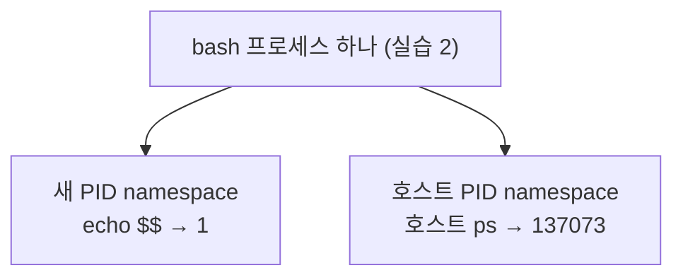
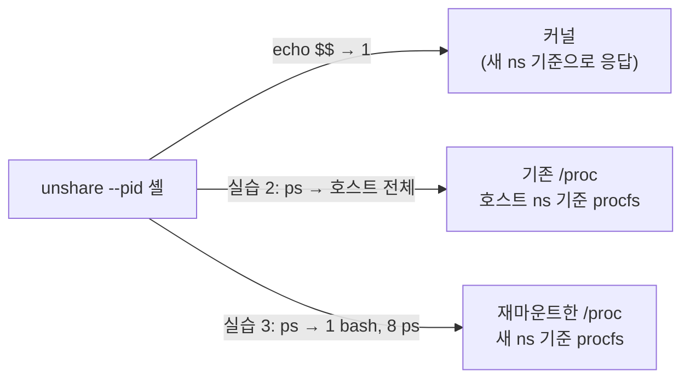
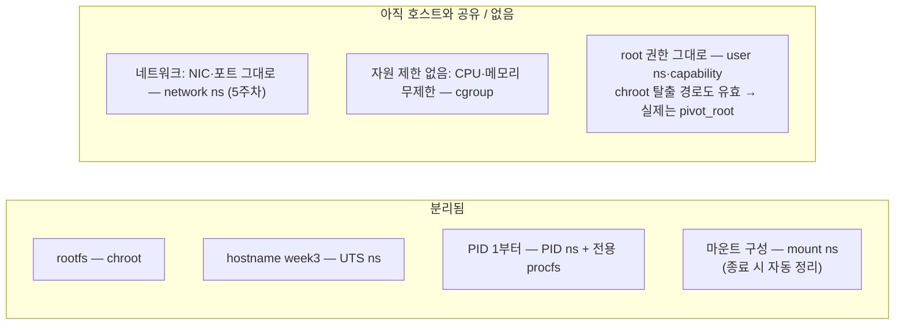

# 3주차: rootfs에 namespace를 더해 격리하기 — 실습 정리

환경: Ubuntu VM (cluster06, kernel 5.15.0-190-generic)

## 도입: 프로세스와 namespace 연결 확인

```text
$ echo $$
136307
$ ls -l /proc/$$/ns
... pid -> 'pid:[4026531836]'  uts -> 'uts:[4026531838]'  mnt -> 'mnt:[4026531841]' ...

$ bash --norc
bash-5.1$ echo "자식 셸 PID=$$"
자식 셸 PID=136883
bash-5.1$ ls -l /proc/$$/ns
... pid -> 'pid:[4026531836]'  uts -> 'uts:[4026531838]'  mnt -> 'mnt:[4026531841]' ...
```

확인 결과:

- PID는 136307 vs 136883으로 다르지만 **ns 링크 10개의 번호는 전부 동일**. 새 프로세스를 만들어도 namespace는 부모 것을 물려받는다.
- PID가 다른 두 셸이 같은 PID namespace를 쓸 수 있나? — 가능하고 이게 그 사례. 둘 다 `pid:[4026531836]`. **namespace는 프로세스들이 공유하는 채번 공간이고, PID는 그 안에서 발급된 번호**다. 같은 시퀀스에서 뽑은 서로 다른 두 값인 셈.

## 1. UTS namespace: hostname만 분리

```text
$ hostname
cluster06
$ sudo unshare --uts bash
# hostname
cluster06          ← 새 UTS ns는 호스트 값을 복사해서 시작
# hostname week3
# hostname
week3
# ps -e -o pid,comm
      1 systemd
    ...호스트 전체 (137049 bash = 이 셸 자신)...
# exit
$ hostname
cluster06          ← 호스트는 영향 없음
```

- 안에서 `week3`로 바꿔도 호스트는 `cluster06` 유지. 바뀐 값은 새 UTS namespace에만 있었고, 마지막 프로세스가 죽으면서 namespace째 사라졌다.
- `ps`에는 호스트 프로세스가 전부 보임 — **UTS만 나눴으니 PID namespace는 그대로**. namespace는 종류별로 독립이다.
- 프롬프트가 계속 `root@cluster06`인 건 셸 시작 시점 문자열이라 그런 것. 판정은 `hostname` 명령 출력 기준.

## 2. PID namespace만 분리: `$$`와 `ps`의 기준 어긋남

```text
$ sudo unshare --pid --fork bash
# echo $$
1
# ps -e -o pid,ppid,comm
      1       0 systemd
    ...호스트 전체...
 137072  137071 unshare
 137073  137072 bash      ← 이 셸 자신
 137080  137073 ps
```

- **`$$` = 1**: 커널이 직접 알려주는 값이라 새 PID namespace 기준.
- **`ps` = 호스트 전체**: `ps`는 `/proc`을 읽는데, 그 `/proc`은 아직 호스트 PID namespace 기준으로 마운트된 procfs 그대로.
- 결정적 한 컷: 목록 안에 이 셸 자신이 `137073 bash`로 보인다. **같은 프로세스가 자기 namespace에서는 1, 호스트 기준으로는 137073** — PID는 절대값이 아니라 namespace마다 따로 매기는 번호다. (심화 1 참고)

## 3. `--mount-proc`: 새 PID namespace 기준 procfs

```text
$ sudo unshare --pid --fork --mount-proc bash
# echo $$
1
# ps -e -o pid,ppid,comm
      1       0 bash
      8       1 ps
# findmnt /proc
/proc  proc   proc   rw,nosuid,nodev,noexec,relatime
/proc  proc   proc   rw,nosuid,nodev,noexec,relatime
```

| 관찰 | 실습 2 (기존 `/proc`) | 실습 3 (`--mount-proc`) |
|---|---|---|
| `echo $$` | 1 | 1 |
| `ps` | 호스트 전체 | `1 bash`, `8 ps` 뿐 |

- 두 실습 모두 셸의 PID는 1로 같다. **달라진 건 셸이 아니라 `ps`가 읽는 procfs가 어느 PID namespace 기준으로 마운트됐는가**다.
- `findmnt /proc`가 두 줄인 이유: 아래는 호스트에서 물려받은 기존 마운트, 위는 `--mount-proc`가 그 위에 덮어 마운트한 새 procfs. 같은 경로에 겹치면 맨 위 것이 보이므로 `ps`는 새것을 읽는다. 이 덮어쓰기가 호스트로 안 새는 게 mount namespace의 역할.
- `ps`가 8번인 건 bash 초기화 과정에서 앞 번호들이 소모·회수됐기 때문. 번호가 namespace 안에서 순차 채번된다는 점만 보면 된다.

## 4. rootfs 결합: namespace + chroot

```text
$ sudo unshare --uts --pid --fork --mount bash
# mount --make-rprivate /
# hostname week3
# mkdir -p tmproot/proc
# mount -t proc proc tmproot/proc
# findmnt --mountpoint tmproot/proc
/home/ubuntu/tmproot/proc proc   proc   rw,relatime
# exec chroot tmproot /bin/sh

/ # hostname
week3
/ # echo $$
1
/ # ps
    1 root  /bin/sh
   14 root  ps
/ # ls -l /bin/sh
-rwxr-xr-x  411 root root 1041984 May 13 02:21 /bin/sh
/ # ls /
bin dev etc home lib lib64 proc root sys tmp usr var
/ # exit

$ hostname
cluster06
$ findmnt --mountpoint tmproot/proc     (빈 출력)
```

2주차와 비교하면:

| 항목 | 2주차 (chroot만) | 3주차 (ns + chroot) | 담당 기능 |
|---|---|---|---|
| `ls /` | tmproot 내용 | tmproot 내용 (동일) | chroot |
| `hostname` | cluster06 (호스트와 공유) | **week3** | UTS ns |
| `echo $$` | 136704 (호스트 번호 연속) | **1** | PID ns |
| `ps` | procfs 마운트 시 호스트 전체 | **sh, ps 뿐** | PID ns + 전용 procfs |
| procfs 정리 | 수동 `umount` 필요 | **자동 해제** | mount ns (프로세스 소멸과 함께) |

- `exec chroot`라서 준비하던 bash가 sh로 교체됨 — PID 1 유지, exit 한 번에 호스트 복귀.
- 마지막 `findmnt`가 빈 출력인 이유: `tmproot/proc` 마운트는 새 mount namespace 안의 일이었고, 그 namespace를 쓰는 프로세스가 없어지자 마운트도 함께 해제됐다. 2주차처럼 호스트에서 umount할 필요가 없다.

## 체크리스트

- [x] chroot는 namespace를 나누지 않는다(2주차: 경로 기준만 변경). namespace는 UTS=hostname, PID=프로세스 번호 공간, mount=마운트 구성으로 분리 대상이 각각 다르다
- [x] 부모(136307)/자식(136883) 셸의 PID는 다르지만 ns 식별값은 전부 동일
- [x] UTS 안에서 `week3`로 바꿔도 exit 후 호스트는 `cluster06`
- [x] PID만 분리: `$$`=1인데 `ps`는 호스트 전체 / `--mount-proc`: `ps`도 새 기준 2줄
- [x] rootfs 안에서 hostname(UTS)·PID 1(PID ns)·파일 목록(chroot) 확인, 기능별 매핑은 위 비교 표
- [x] 종료 후 호스트 hostname 원복, `findmnt` 빈 출력 (mount ns 소멸로 자동 해제)

## 심화 질문

**1. 같은 프로세스가 컨테이너 안에서는 PID 1, 호스트에서는 다른 PID로 보이는 이유는?**

**답: PID는 프로세스의 절대값이 아니라 PID namespace마다 따로 채번하는 번호라서. 한 프로세스가 namespace별 번호를 동시에 갖는다.**

프로세스가 새 PID namespace에 들어가도 호스트 namespace에서 빠지는 게 아니라 양쪽에 모두 속하고, 커널은 namespace별 번호를 전부 기록해 둔다. 조회하는 쪽의 namespace 기준으로 번호가 보인다. 실습 2의 bash가 사례 — `echo $$`는 1, 호스트 procfs로는 137073, 둘 다 같은 프로세스. 컨테이너의 PID 1도 호스트에서 보면 평범한 번호의 프로세스다(1주차에 `docker run` 프로세스가 호스트 `ps`에 보였던 이유).



**2. 새 PID namespace에서 procfs를 다시 mount하지 않으면 `ps` 결과는 왜 기대와 달라질까?**

**답: `ps`는 커널이 아니라 `/proc`을 읽는데, procfs는 마운트 시점의 PID namespace가 기준으로 고정되기 때문. 기존 `/proc`은 호스트 기준으로 마운트된 것이라 `ps`가 계속 호스트 목록을 읽는다.**

그래서 `$$`(커널 직접 조회 → 새 기준 1)와 `ps`(`/proc` 경유 → 호스트 기준)의 데이터 소스가 어긋난다 — 실습 2의 결과 그대로. 해결은 새 namespace 안에서 procfs를 다시 마운트하는 것(실습 3의 `--mount-proc`, 실습 4의 `mount -t proc`)이고, 그 재마운트가 호스트 `/proc`을 건드리지 않도록 mount namespace를 함께 분리한다.



**3. 현재 환경에 있는 컨테이너 성질과, 아직 없는 것은?**

**답: "따로 보이게" 하는 격리(rootfs·hostname·PID·마운트)는 갖췄고, "못 쓰게/못 나가게" 하는 제한(네트워크·자원·권한)이 없다.**

갖춘 것:

- 전용 rootfs — `ls /`가 busybox 목록 (chroot)
- 독립 hostname — week3로 바꿔도 호스트 무영향 (UTS ns)
- PID 1부터 시작하는 독립 프로세스 목록 (PID ns + 전용 procfs)
- 호스트에 안 새는 마운트, 종료 시 자동 정리 (mount ns)

"못 쓰게/못 나가게" 하는 쪽은 없다:

- **네트워크 공유** — NIC·포트·라우팅이 호스트 그대로라, 안에서 8080을 열면 호스트의 8080이 점유된다 (network ns, 5주차)
- **자원 제한 없음** — 안에서 무한루프 하나 돌리면 호스트 CPU를 그대로 다 쓴다 (cgroup)
- **root 권한 그대로** — user ns·capability 축소가 없고 chroot 기반이라, 2주차 심화 3의 탈출 경로(mknod, chroot 재호출)가 여전히 유효하다. 실제 컨테이너가 pivot_root를 쓰는 이유.



**4. makecontainer.sh**

```sh
#!/bin/sh
# 사용법: ./makecontainer.sh <rootfs> [명령 [인자...]]
#   ./makecontainer.sh tmproot            → /bin/sh
#   ./makecontainer.sh tmproot /bin/ls /  → 명령만 실행하고 종료
set -e

ROOTFS="$1"
if [ -z "$ROOTFS" ] || [ ! -d "$ROOTFS" ]; then
    echo "usage: $0 <rootfs-dir> [command...]" >&2
    exit 1
fi
shift
[ $# -eq 0 ] && set -- /bin/sh

exec sudo unshare --uts --pid --fork --mount sh -c '
    ROOTFS="$1"; shift
    mount --make-rprivate /
    hostname "$(basename "$ROOTFS")"
    mkdir -p "$ROOTFS/proc"
    mount -t proc proc "$ROOTFS/proc"
    exec chroot "$ROOTFS" "$@"
' sh "$ROOTFS" "$@"
```

- 실습 4의 수동 절차를 그대로 옮긴 것. hostname은 rootfs 디렉터리 이름, `sh -c '...' sh "$ROOTFS" "$@"`는 따옴표 안 스크립트에 인자를 넘기는 방식(`$0`=sh, `$1`=rootfs, 나머지=명령).
- 마지막이 `exec chroot`라 중간 셸이 안 남고, 명령이 끝나면 namespace·마운트도 함께 정리된다.

실행 확인:

```text
$ chmod +x makecontainer.sh
$ ./makecontainer.sh tmproot /bin/sh
/ # hostname
tmproot
/ # echo $$
1
/ # exit

$ ./makecontainer.sh tmproot /bin/ls /
bin    dev    etc    home   lib    lib64  proc   root   sys    tmp    usr    var

$ ./makecontainer.sh
usage: ./makecontainer.sh <rootfs-dir> [command...]
```

- 컨테이너 안에서 `./makecontainer.sh`를 다시 치면 `not found` — 스크립트는 호스트 파일이라 tmproot 안에는 없다. rootfs가 분리됐다는 증거.
