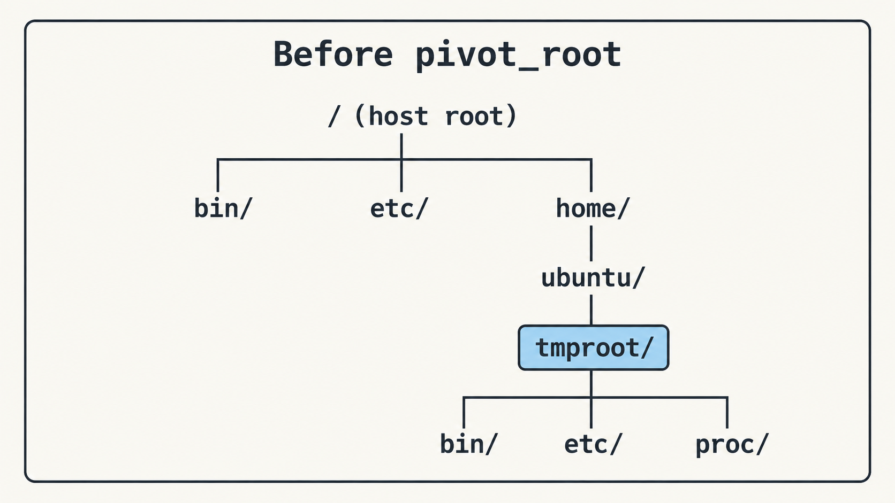
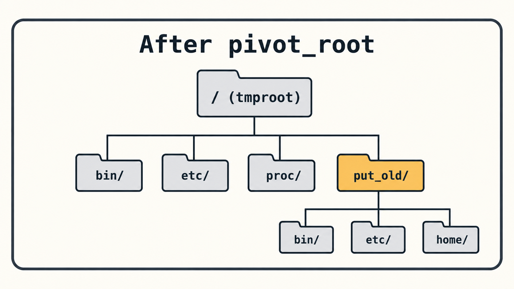

# 4주차: 루트 파일시스템을 교체하고 자원 제한하기

- 영상: [카카오 핸즈온 1:51:52~1:58:34](https://www.youtube.com/watch?v=lVtgqmjv4BQ)
- 선택 읽기: [`pivot_root(2)` 매뉴얼](https://man7.org/linux/man-pages/man2/pivot_root.2.html), [cgroups v2 개요](https://www.kernel.org/doc/html/latest/admin-guide/cgroup-v2.html)

## 이번 주 목표

- `pivot_root`로 mount namespace의 루트를 교체하고 이전 루트를 정리하기
- cgroup으로 프로세스의 메모리와 CPU 사용량 제한하기
- 제한 전후의 측정값을 비교하고 namespace와 cgroup의 역할 설명하기

## 시작하기

### 지난주 실습 이어가기

2주차에는 BusyBox의 파일을 `tmproot`에 꺼내고 `chroot`로 셸이 사용하는 `/`의 기준을 바꿨습니다. 3주차에는 UTS·PID·mount namespace도 나눴습니다. hostname과 PID 번호 공간, 마운트 구성을 분리하고 새 PID namespace에 맞는 procfs도 연결했습니다.

지금까지의 실행 흐름은 다음과 같습니다.

```text
BusyBox 파일을 tmproot에 준비
        ↓
namespace 생성
        ↓
tmproot를 기준으로 procfs와 hostname 준비
        ↓
chroot tmproot /bin/sh
```

이번 주에는 이 실행 환경의 rootfs를 `pivot_root`로 교체합니다. `pivot_root`는 현재 mount namespace의 루트 마운트를 새 rootfs로 교체하고, 이전 루트를 새 루트 아래의 디렉터리로 옮깁니다.

`pivot_root`로 이전 루트를 분리하고 작업 디렉터리를 `/`로 바꾸면 새 rootfs를 구성할 수 있습니다. `chroot`만으로 남는 문제도 줄어듭니다.

실습에서 확인할 명령은 다음과 같습니다.

| 명령어                             | 확인할 내용                                           |
| ---------------------------------- | ----------------------------------------------------- |
| `unshare --mount --uts`, `findmnt` | 마운트 namespace와 bind mount 상태 확인               |
| `pivot_root . put_old`             | 새 rootfs를 `/`로 바꾸고 기존 루트를 `put_old`에 옮김 |
| `ls /`, `ls /put_old`              | 새 루트와 이전 루트의 파일 목록 비교                  |

## 핵심 개념

### `pivot_root`의 실행 조건

`pivot_root`에 사용할 새 루트는 mount point여야 합니다. 일반 디렉터리인 `tmproot`를 bind mount하면 이 조건을 갖출 수 있습니다.

전환 순서는 다음과 같습니다.

```text
새 mount namespace 생성
        ↓
rootfs를 자기 자신에 bind mount
        ↓
rootfs 안에 이전 루트용 디렉터리 준비
        ↓
pivot_root로 루트 교체
        ↓
작업 디렉터리를 새 /로 이동
        ↓
이전 루트 마운트 분리
```

### namespace와 cgroup의 역할

namespace는 프로세스가 **무엇을 볼 수 있는지**를 나눕니다. cgroup은 프로세스가 **얼마나 사용할 수 있는지**를 제한합니다.

cgroup v2는 하나의 계층 아래에 controller와 설정 파일을 둡니다. 실습에서는 `test-cgroup` 그룹을 만들어 그 안에서 부하를 실행합니다.

| 파일                 | 역할                                         |
| -------------------- | -------------------------------------------- |
| `cgroup.controllers` | 현재 계층에서 사용할 수 있는 controller 확인 |
| `cgroup.procs`       | 그룹에 넣을 프로세스의 PID 등록              |
| `memory.max`         | 메모리 상한 설정                             |
| `memory.swap.max`    | swap 사용량 상한 설정                        |
| `memory.events`      | 메모리 부족과 OOM kill 횟수 확인             |
| `cpu.max`            | 일정 주기마다 사용할 CPU 시간 설정           |
| `cpu.stat`           | throttling 횟수와 CPU 사용량 확인            |

`cgroup.procs`에 PID를 넣으면 그 프로세스와 이후 생성되는 자식 프로세스가 같은 그룹에서 실행됩니다. 메모리가 상한을 넘으면 커널은 그룹 안의 프로세스를 종료할 수 있고, CPU 상한에 도달하면 프로세스를 종료하는 대신 다음 주기까지 실행을 늦춥니다.

`cpu.max`의 `50000 100000`은 100ms 주기마다 최대 50ms의 CPU 시간을 허용한다는 뜻입니다. `memory.max`에는 바이트 단위의 값을 씁니다. 예를 들어 50 MiB는 `52428800`입니다.

## 실습 준비

3주차에서 만든 `tmproot`가 있는 디렉터리에서 진행합니다. rootfs에 셸과 실습에 필요한 명령이 있는지 확인하고, 부하 측정에 사용할 도구를 설치합니다.

```bash
ls tmproot/bin/sh
sudo apt-get update
sudo apt-get install -y stress-ng
```

실습은 `/sys/fs/cgroup` 아래의 cgroup v2를 기준으로 진행합니다.

```bash
stat -fc %T /sys/fs/cgroup
cat /sys/fs/cgroup/cgroup.controllers
```

첫 명령 결과가 `cgroup2fs`인지 보고, 두 번째 명령에서 `memory`와 `cpu` controller가 보이는지 확인합니다.

## 실습

### 1. `pivot_root`로 rootfs 교체하기

먼저 mount와 UTS namespace를 나눕니다. **이 단계는 `tmproot` 안의 BusyBox 셸이 아니라 호스트 셸에서 시작합니다.** 3주차 실습 셸이 열려 있다면 `exit`으로 호스트 셸로 나온 뒤, `tmproot`가 있는 디렉터리에서 진행하세요. `tmproot`에 준비한 rootfs를 그대로 사용하므로 이미지를 다시 풀 필요는 없습니다.

```bash
# 새 mount·UTS namespace 안에서 호스트의 /bin/sh 실행
sudo unshare --mount --uts /bin/sh
```

전환 전에는 호스트 루트 아래의 `/home/ubuntu/tmproot`가 새 rootfs 후보로 놓여 있습니다.



**새 셸 안에서** 아래 명령을 한 줄씩 실행합니다. bind mount 뒤에는 `findmnt`로 `tmproot`가 mount point가 되었는지 확인합니다.

```bash
df -h
# 여기서 한 mount 변경이 호스트로 전파되지 않게 함
mount --make-rprivate /
# pivot_root에 쓸 절대 경로 : 각자 위치에 맞게 변경
ROOTFS=/home/ubuntu/tmproot
# 일반 디렉터리를 mount point로 만듦
mount --bind "$ROOTFS" "$ROOTFS"
findmnt --target "$ROOTFS"
# 이전 호스트 루트를 잠시 옮길 위치
mkdir -p "$ROOTFS/put_old"
cd "$ROOTFS"
# 현재 디렉터리를 새 /로, 이전 /(root)를 put_old로 pivot_root
pivot_root . put_old
cd /
```

전환 뒤에는 `tmproot`가 `/`가 되고, 이전 호스트의 루트는 `/put_old` 아래로 갑니다.



**같은 셸에서** 새 루트와 이전 루트의 상태를 확인합니다.

```bash
ls /
ls /put_old | head
```

`ls /`에서는 BusyBox rootfs의 파일이 보이고, `ls /put_old`에서는 이전 루트의 파일이 보입니다. 아직 새 rootfs의 `/proc`에는 procfs를 마운트하지 않았으므로, BusyBox의 `df -h`는 `/proc/mounts`를 찾지 못해 실패할 수 있습니다.

#### 이전 루트 정리하기

먼저 **rootfs 안의 셸에서** `/put_old`를 분리합니다. 이 작업이 끝나면 새 rootfs에서 이전 호스트 루트로 가는 경로가 사라집니다.

```bash
umount -l /put_old # 이전 루트를 경로에서 먼저 분리
rmdir /put_old
```

#### procfs 연결하고 확인

지난주처럼 새 rootfs의 `/proc`에 procfs를 마운트해봅시다. `ps`와 `df`는 이 경로에서 프로세스와 마운트 정보를 읽습니다.

```bash
mount -t proc proc /proc # 새 rootfs의 /proc에 procfs 연결
hostname week4 # 새 UTS namespace 안에서만 hostname 변경
df -h
```

이제 rootfs 안의 명령과 프로세스 목록을 확인합니다.

```bash
echo "pid=$$"
hostname
ls /
ps
mount | grep 'on /proc '
```

> 확인: `ls /`에 보이는 파일, `ps`에 보이는 프로세스, hostname을 각각 어떤 namespace·rootfs 설정이 결정했나요?

실습을 마치면 rootfs 셸을 종료합니다.

```bash
exit
```

mount namespace가 함께 종료되므로 실습 중 만든 bind mount와 procfs도 사라집니다. 호스트에서 `tmproot`가 mount point로 남지 않았는지 확인합니다.

```bash
findmnt --mountpoint tmproot
```

### 2. Docker 컨테이너의 cgroup 확인하기

컨테이너가 어떤 cgroup에 들어가는지 확인합니다.

```bash
# 현재 셸이 속한 cgroup 경로
cat /proc/self/cgroup
# 메모리와 swap을 각각 50 MiB로 제한한 컨테이너 실행
sudo docker run --rm --memory 50m --memory-swap 50m alpine:3.20 \
  sh -c 'cat /proc/self/cgroup; cat /sys/fs/cgroup/memory.max; cat /sys/fs/cgroup/memory.swap.max'
```

> 확인: 컨테이너 안의 `memory.max`와 `memory.swap.max`는 각각 어떤 값인가요? `cat /proc/self/cgroup`의 경로는 호스트 셸과 어떻게 다른가요?

Docker가 설정한 제한은 컨테이너 프로세스가 속한 cgroup 파일에 반영됩니다. 이제 같은 제한을 직접 만들어봅니다.

### 3. 메모리 제한과 OOM 이벤트 확인하기

사용 가능한 controller와 기존 cgroup 구성을 확인합니다.

```bash
# 이 계층에서 쓸 수 있는 controller 목록
cat /sys/fs/cgroup/cgroup.controllers
# systemd가 만든 현재 cgroup 트리
systemd-cgls
```

실습용 cgroup을 만들고 필요한 파일이 생성됐는지 확인합니다.

```bash
# 실습용 cgroup 생성
sudo mkdir /sys/fs/cgroup/test-cgroup
# memory controller가 만든 설정·관찰 파일 확인
ls /sys/fs/cgroup/test-cgroup/{memory.max,memory.swap.max,memory.events}
```

세 파일이 없다면 부하를 실행하지 말고 controller 구성을 확인합니다. 기존 system cgroup은 수정하지 않습니다.

```bash
# 메모리 상한과 swap 상한 설정
echo 52428800 | sudo tee /sys/fs/cgroup/test-cgroup/memory.max
echo 0 | sudo tee /sys/fs/cgroup/test-cgroup/memory.swap.max
# 설정값과 OOM 이벤트의 초기값 확인
cat /sys/fs/cgroup/test-cgroup/{memory.max,memory.swap.max,memory.events}
```

한 터미널에서 이벤트를 관찰합니다.

```bash
# memory.events 변화를 2초마다 관찰
watch cat /sys/fs/cgroup/test-cgroup/memory.events
```

다른 터미널에서 셸의 PID를 cgroup에 넣은 뒤, 같은 셸에서 `stress-ng`를 실행합니다.

```bash
# 새 셸을 cgroup에 넣고, 소속 경로를 출력한 뒤 메모리 부하 실행
sudo bash -c 'echo $$ > /sys/fs/cgroup/test-cgroup/cgroup.procs && cat /proc/self/cgroup && exec stress-ng --vm 1 --vm-bytes 100M --vm-keep --timeout 20s'
```

> 확인: 실행 전후 `memory.events`의 `oom`과 `oom_kill` 값이 어떻게 달라졌나요? 부하 프로세스가 제한된 그룹 안에서 실행됐다는 근거는 어디에서 확인할 수 있나요?

부하가 끝나면 `watch`를 `Ctrl-C`로 닫습니다.

### 4. CPU 제한 전후 비교하기

먼저 제한 없이 CPU 부하를 실행합니다. 다른 터미널의 `top`이나 `systemd-cgls`로 실행 상태를 관찰합니다.

```bash
# cgroup에 넣은 셸을 CPU 부하 프로세스로 교체
sudo bash -c 'echo $$ > /sys/fs/cgroup/test-cgroup/cgroup.procs && exec stress-ng --cpu 1 --timeout 20s'
```

같은 그룹에 CPU quota를 설정한 뒤 다시 실행합니다.

```bash
# 100ms마다 CPU를 최대 50ms만 사용하도록 quota 설정
echo '50000 100000' | sudo tee /sys/fs/cgroup/test-cgroup/cpu.max
# 같은 부하를 다시 실행해 quota 효과 비교
sudo bash -c 'echo $$ > /sys/fs/cgroup/test-cgroup/cgroup.procs && exec stress-ng --cpu 1 --timeout 20s'
# 적용한 quota와 throttling 측정값 확인
cat /sys/fs/cgroup/test-cgroup/cpu.max
cat /sys/fs/cgroup/test-cgroup/cpu.stat
```

> 확인: 제한 전후 CPU 사용률이 어떻게 달라졌나요? `cpu.stat`의 `nr_throttled`와 `throttled_usec`에서 어떤 흔적을 찾을 수 있나요?

### 5. 3주차 실행 흐름에 cgroup 연결하기

3주차의 실행 흐름은 namespace와 rootfs를 준비한 뒤 셸을 실행하는 구조였습니다. 여기에 cgroup을 추가하면 대상 명령을 실행하기 전에 프로세스를 실습용 그룹에 넣어야 합니다.

```text
namespace 생성
        ↓
rootfs와 procfs 준비
        ↓
프로세스를 cgroup에 등록
        ↓
대상 명령 실행
```

다음 명령으로 소속 cgroup을 확인합니다.

```bash
# 새 셸을 cgroup에 넣은 뒤, 소속 경로를 출력하고 CPU 부하 실행
sudo bash -c 'echo $$ > /sys/fs/cgroup/test-cgroup/cgroup.procs && exec sh -c '\''cat /proc/self/cgroup; exec stress-ng --cpu 1 --timeout 5s'\'''
```

스크립트에서는 부모가 cgroup을 만들고, 자식이 대상 명령을 실행하기 전에 `cgroup.procs`에 자신의 PID를 등록합니다. 제한 설정과 등록이 끝나기 전에 대상 명령이 시작되지 않도록 실행 순서를 지켜야 합니다.

### 6. 실습 자원 정리하기

부하가 모두 끝났는지 확인한 뒤 cgroup 안에 남은 프로세스가 없는지 확인합니다. `cgroup.procs`가 비어 있어야 디렉터리를 삭제할 수 있습니다.

```bash
# 남은 프로세스가 없으면 빈 출력
cat /sys/fs/cgroup/test-cgroup/cgroup.procs
# 비어 있는 실습용 cgroup만 삭제 가능
sudo rmdir /sys/fs/cgroup/test-cgroup
# 삭제 뒤 트리에서 사라졌는지 확인
systemd-cgls
```

## 체크리스트

- [ ] `pivot_root`에 필요한 mount point와 `put_old` 디렉터리를 준비할 수 있다.
- [ ] `pivot_root` 후 이전 루트가 `/put_old`에 생겼다가 분리되는 것을 확인했다.
- [ ] `pivot_root` 실습 후 호스트에 procfs나 bind mount가 남지 않았다.
- [ ] namespace가 보이는 범위를 나누고 cgroup이 자원 사용량을 제한한다는 점을 구분할 수 있다.
- [ ] 메모리 제한과 OOM 이벤트를 측정값으로 기록했다.
- [ ] CPU quota의 두 숫자와 throttling 측정값을 설명할 수 있다.
- [ ] 실습이 끝난 뒤 `test-cgroup` cgroup과 그 안의 프로세스가 남지 않았다.

## 심화 질문

1. `pivot_root` 후 이전 루트를 `put_old`에서 분리하는 이유는 무엇일까?
2. namespace와 cgroup은 각각 어떤 문제를 해결할까? namespace만 만들고 cgroup을 만들지 않으면 부하가 큰 프로세스에서 무엇이 달라질까?
3. rootfs·namespace·cgroup을 사람이 순서대로 설정하는 대신 runtime이 처리하려면 부모와 자식 프로세스가 각각 어떤 일을 맡아야 할까?
4. 3주차의 스크립트에서 `pivot_root`와 이전 루트 정리까지 수행하도록 추가하여 제출해주세요. rootfs와 실행할 명령을 인자로 받으면 됩니다. 예: `sudo ./makecontainer.sh /home/ubuntu/tmproot /bin/sh`